# Proyecto No. 3

A continuacion se presenta el desarrollo del proyecto 3, donde se ha implementado un flujo de MLOps para la inferencia de un modelo de clasificacion. Los servicios utilizados en el back son PostgreSQL, FASTAPI, Minio, Airflow, Mlflow y Locust. Para la seccion del front se han utilizado Prometheus y Grafana. 

## 1. Servicios

### 1.0 Orquestacion y administracion de servicios

Los servicios seran orquestados con Airflow a traves de la ejecucion secuencial de dags. 

Por su parte, el servicio de Airflow sera administrado con docker compose, mientras que los servicios restantes seran adminsitrados con kubernetes.

En una posterior seccion se detallara la configuracion del Airflow y Kubernetes.

### 1.1 Dataset

Los datos que se procesaran y sobre el cual se realizaran inferencias de un modelo de clasificacion es Diabetes 130-US Hospitals for Years 1999-2008 (https://archive.ics.uci.edu/dataset/296/diabetes+130-us+hospitals+for+years+1999-2008). El dataset esta compuesto por variables categoricas y cuantitativas. Para disponibilizar los datos, se ha levantado un servicio en FASTAPI.

Teniendo en cuenta los requisitos del proyecto, los datos se han particionado en datos de entrenamiento, validacion y evaluacion. Los datos se cargan por batch de 15000 registros, por consiguiente, se han definido endpoints para obtener el numero de batches para cada particion. Asi mismo, se han definido controles para dar seguimiento a los datos procesados.

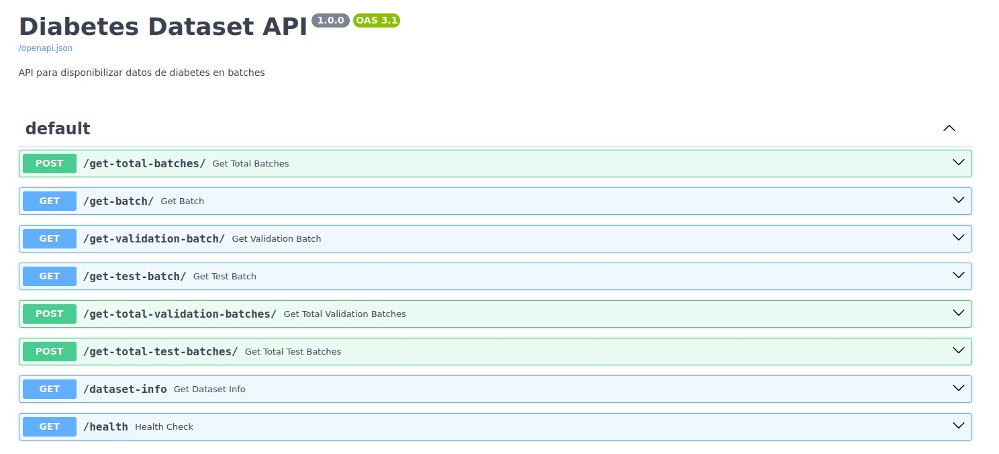

### 1.2 Kubernetes

Se accede al servicio de kubernetes a traves de Minikube, por consiguente, es necesario realizar la instalacion de minikube

``` curl -LO https://storage.googleapis.com/minikube/releases/latest/minikube-linux-amd64 ```
``` sudo install minikube-linux-amd64 /usr/local/bin/minikube ```

Posteriomente se instala kubectl y se le otorgan permisos, herramienta que permite la interaccion con kubectl

``` curl -LO "https://dl.k8s.io/release/$(curl -s https://dl.k8s.io/release/stable.txt)/bin/linux/amd64/kubectl" ```
``` chmod +x kubectl ```
``` sudo mv kubectl /usr/local/bin/ ```
``` kubectl version --client ```

Tambien se puede utilizar:

 ```sudo snap install kubectl --classic ```

La configuracion de cada servicio se encuentra en archivos en formato yaml. Los servicio de datapi, minio, mlflow y las bases de datos se encuentran en la carpeta model_training -> yaml_files. Cada archivo yaml contiene la parametrizacion del "config map", "service" y "deployment".

Se inicializa un perfil en minikube

``` minikube start -p mlflowkub ```

Se selecciona el perfil existente

``` minikube profile mlflowkub ```

Se visualiza la Ip del cluster

``` minikube -p mlflowkub ip ```

Una vez creado el cluster y nodo principal, por medio de kubectl se crean los pods y servicios. Para cada uno de los servicios en formato yaml se debe generar la siguiente instruccion:

``` kubectl apply -f <filename_service.yaml> ```

Importante validar que los pods y servicios esten activos y corriendo (running) por medio de la instruccion:

``` kubectl get pods ```

Así mismo, se verifica que los puertos se hayan disponibilizado segun la parametrizacion en los archivo yaml donde se indican los servicios a traves de kubernetes.

``` kubectl get svc ```

Para disponibilizar los puertos a diferentes máquinas que se encuentran conectadas a la misma red (En este caso es posible porque las maquinas virtuales estan en la red de la PUJ), se utilizara socat porque permite la comunicacion bidireccional.

https://www.redhat.com/es/blog/getting-started-socat

Por consiguiente, se procede a instalar socat con los siguientes comandos en terminal:

``` sudo apt-get update ```
``` sudo apt-get install socat  ```

Una vez instalado socat, se procede con la creacion de un archivo en formato sh, donde se establece la comunicacion entre la ip del cluster creado en minikube y la ip de la maquina virtual que permitira el acceso de los otros equipos.

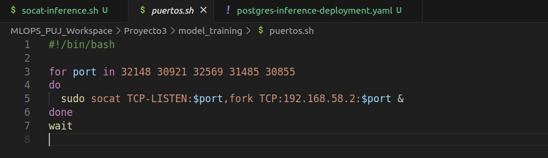

Teniendo en cuenta que se han disponibilizado servicios en multiples maquinas, encontrara multiples archivos ".sh", por consiguiente, para cada archivo en dicho formato es necesario ejecutarlo con la siguiente instruccion:

``` ./<socat_filename.sh> ```

Por ejemplo, el servicio que disponibiliza la base de datos que suministra información al front es:

``` ./socat-inference.sh ```

Es importante mencionar que los servicios se disponibilizaron a traves de 3 maquinas, dividos en las siguientes secciones:

    a) Servicios ingesta de datos y entrenamiento de modelo: MLOPS_PUJ_Workspace/Proyecto3/model_training/yaml_files
       Socat file: puertos.sh
    b) Servicio base de datos para inferencia: MLOPS_PUJ_Workspace/Proyecto3/model_training/yaml_files
        Socat file: socat-inference.sh
    c) Servicios front: MLOPS_PUJ_Workspace/Proyecto3/api_read_models/komposefiles
        Socat file: socat-service.yaml
    d) Servicios observabilidad: MLOPS_PUJ_Workspace/Proyecto3/Observabilidad/komposefiles
    
    DataAPI-External:
    10.43.101.168:32569
    Mlflow:
    10.43.101.168:31485
    Minio:
    10.43.101.168:30921
    BBDD Diabetes (Postgres):
    10.43.101.168:30921
    BBDD Inferencia:
    10.43.101.166:5433
    Inference API:
    10.43.101.170:45101
    Prometheus:
    10.43.101.170:45110
    Grafana:
    10.43.101.170:45120
    Locust:
    10.43.101.170:45130
    Gradio:
    10.43.101.170:45140


### 1.3 Airflow

El servicio de airflow se levanta por medio de docker compose, por consiguiente es necesario ubicarse en la carpeta que contiene el archivo .yaml con la configuracion de docker:

```cd /Proyecto3/model_training```

Antes de levantar el servicio del contendor, se recomienda crear las redes de docker:

```sudo docker network create proyecto2_airflow_network```
```sudo docker network create --driver bridge my_shared_network```

Se procede a levantar el servicio de Airflow.

```sudo docker compose up --build```

docker compose exec airflow-scheduler airflow connections add \
    --conn-type postgres \
    --conn-host 10.43.101.168 \
    --conn-login airflow \
    --conn-password airflowpass \
    --conn-port 32148 \
    --conn-schema airflow \
postgres_airflow_conn

Se accede a airflow con las credenciales:

user: airflow
password: airflow

En primera instancia es necesario crear la conexion a la base de datos diabetes:

En el menu de Airflow, se ingresa en Admin -> Connections

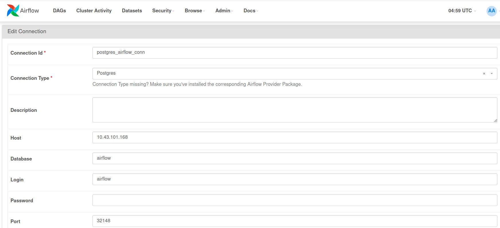


conn id: postgres_airflow_conn

conn type: Postgres

host: 10.43.101.168

database: airflow

login: airflow

password: airflow_pass

port: 32148


* 1.3.0: Orden ejecucion de los DAGS:

    a) iniciar_tabla_mysql

    b) fetch_and_store_diabetes_data

    c) diabetes_etl_fast

    d) diabetes_model_pipeline

La orquestacion a traves de Airflow se realiza a traves de DAGs, por consiguiente, se han creado las siguientes etapas en el proceso:

* 1.3.1 DAG: mysql_start_table.py - iniciar_tabla_mysql
  
Se encarga de la validacion y creacion de la tabla de datos PostgreSQL para almacenar los datos obtenidos mediantes batch del FASTAPI que contiene la tabla de datos Diabetes. Es importante mencionar que la tabla de datos se ha disponibilizado mediante kubernetes, por ello, en la siguiente etapa se consume la IP:puerto generada dicho servicio.

* 1.3.2 DAG: fetch_and_store_data.py - fetch_and_store_diabetes_data

Se ejecuta la consulta al endpoint que contiene la informacion del dataset Diabetes. Importante mencionar que la obtencion de informacion se realiza por batch y para cada particion de datos. Asi mismo, se crean tablas de datos para entrenamiento, validacion y evaluacion en la base de datos.

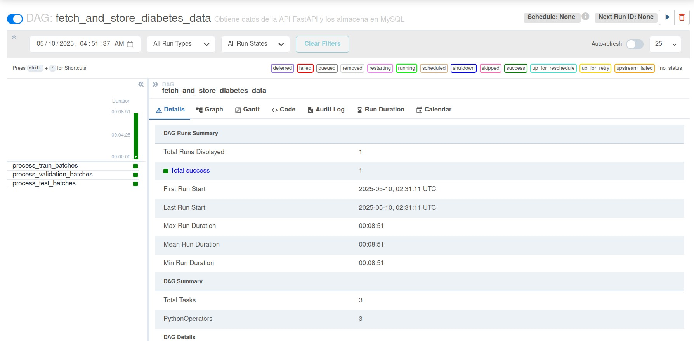

* 1.3.3 DAG: preprocess.py - diabetes_etl_fast

El DAG donde se realiza el preprocesamiento de los datos contiene la lectura de la tabla Postgres, donde se leen los datos de las tablas de datos de entrenamiento, validacion y evaluacion. 

La etapa de procesamiento considera la particion entre variables categoricas y cuantitativas para el dataframe con variables predictoras (X). Por su parte, se crea la variable objetivo (y) para la variable readmitted.

En funcion del analisis exploratorio de datos, se han determinado variables que no son significativas porque era uni-categoricas, concentracion de mas de 99% en una categoria y baja significancia con respecto a la variable objetivo. Considerando la alta dimensionalidad del dataset, la principal estrategia fue limpieza de datos en funcion de los resultados obtenidos del EDA (Analisis exploratorio de datos). Tecnicas como selectkbest de scikit learn no eran procesadas por las limitaciones de computo de la maquina virtual.

Se realiza poblamiento de campos NA para las dos variables que contiene datos perdidos, se asigna la categoria unknown.

Luego se estrablece un pipeline a traves de scikit learn, denominado preprocessor, donde se aplica one-hot encoding a las variables categoricas y standard scales a las variables cuantitativas. De igual forma, es importante mencionar que hay una variable denominada que contiene el diagnostico de los pacientes. Dicha variable contiene 999 categorias de los diagnosticos segun estandar internacional. Para evitar incremento significativo en el proceso de encoding, se realizo agrupacion por categorias entre patologias generales.

Una vez procesados y limpiadas las tablas con datos de entrenamiento, validacion y entrenamiento, se almacenaron los resultados en tres nuevas tablas de datos dentro de la base de datos diabetes.

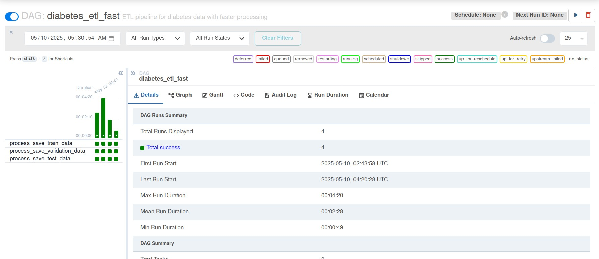

* 1.3.4 DAG: model.py - diabetes_model_pipeline

Considerando los servicios desplegados de minio y mlflow a traves de kubernetes, se exponen los puertos de cada unos de las herramientas con sus respectivas credenciales. 

    - minio

        user: minioadmin
        password: minioadmin123

Se instancia el tracking de mlflow con la ruta del cluster de kubernetes donde se ha desplegado mlflow.

El proceso de entrenamiento consiste en la lectura de datos procesados desde la base de datos. Considerando que la variable objetivo tiene la caracteristica de ser una clase imbalanceada, se procede a realizar balanceo de clases mediante la tecnica undersampling. 

Posteriormente se instancia el cliente de mlflow, se parametriza el exprimento en mlflow y por medio de un contexto python, se ejecuta el experimento de los modelos en mlflow. En ese orden de ideas, se registran los artefactos, logs del experimento en mlflow y metricas del entrenamiento. Con base en lo anterior se determina el mejor modelo, el cual hace transicion de la etapa de staging a production.

El modelo en produccion permite acceder a los pesos del modelo entrenado en formato '.pkl',el cual sera consumido por el FASTAPI de inferencia, el cual a su vez, tendra interaccion locust. 

### 1.4 MlFlow

Con base en la anterior seccion, el DAG donde se realiza el entrenamiento del modelo realiza el proceso de experimentacion en MlFlow, donde se ejecutan múltiples modelos en función del ejercicio cross validation. En la seccion de experimentos se almacenan todas las ejecucion y en la seccion de modelos se almacenan los pesos con el mejor perfomance. De igual forma, para la particion de datos de validacion se han guardado las metricas.

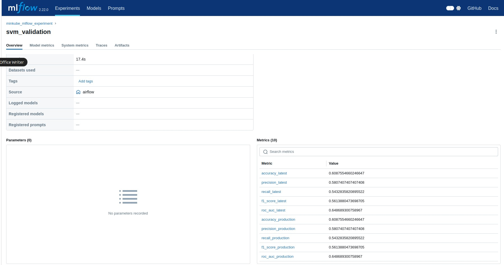

### 1.4 FASTAPI Inferencia

El mejor modelo es consumido por la API de inferencia que se ha disponibilizado en FASTAPI, donde se encuentra el endpoint para hacer la respectiva inferencia. No obstante, el objetivo es acceder al endpoint a través de locust para evaluar la capacidad de ejecucion del flujo de inferencia.

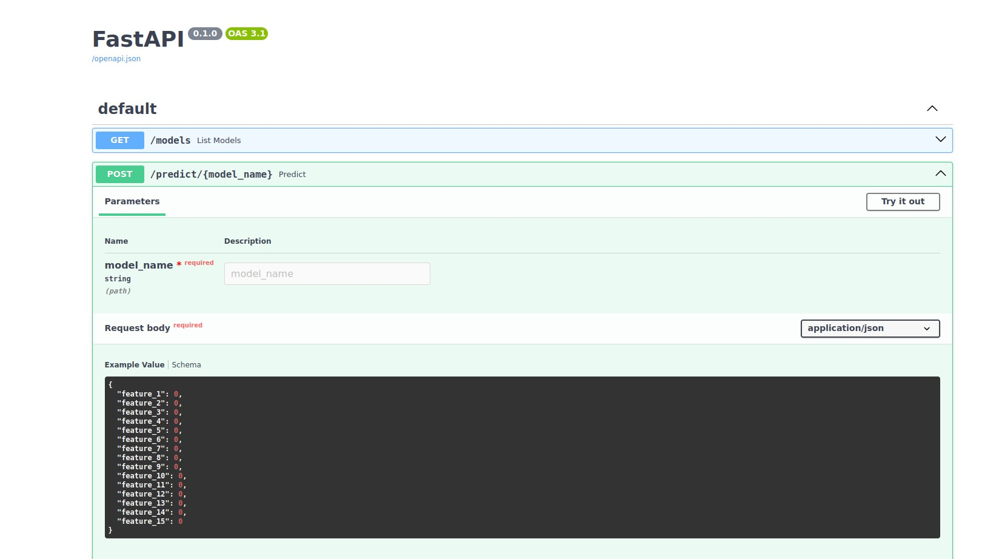

### 1.5 Locust

Se ha probado la herramienta con 1000 inferencias, obteniendo procesamiento en paralelo de 6 inferencias por segundo en promedio. 

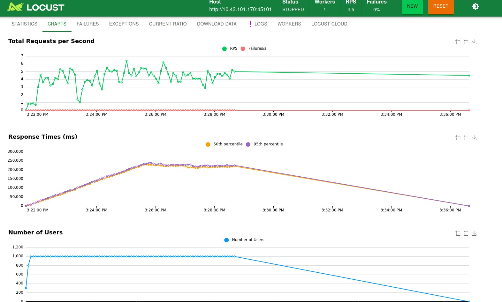

### 1.6 Visualizacion: Prometheus, Grafana y Gradio

Por medio de prometheus se realiza seguimiento y evalua la trazabilidad de las inferencias ejecutadas con locust a traves del endpoint de inferencia creado por Grafana. Como evidencia de los resultados obtenidos, se presenta la variable "predict latency seconds bucket", donde se evidencia la captura de registros asocados a la latencia en segundos por cada inferencia.

Asi mismo, Grafana toma la tabla de datos creada con los registros en mencion y permite visualizarlos en una grafica de series de tiempo, donde se evidencia que por segundo se procesan en promedio 6 inferencias.

Se accede a grafana con las credenciales:
    Usuario:admin
    Contrasena:1234

Por ultimo, se expone el servicio de inferencia Gradio, el cual es la herramienta front con la cual el usuario interactua.

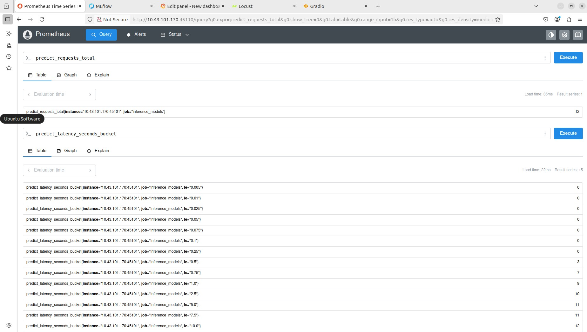

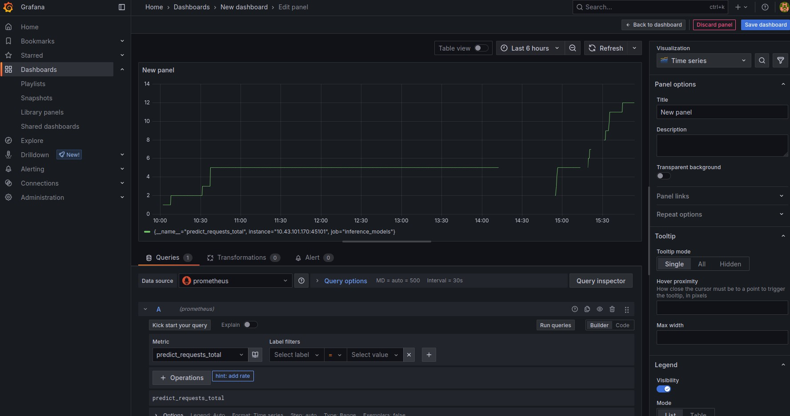

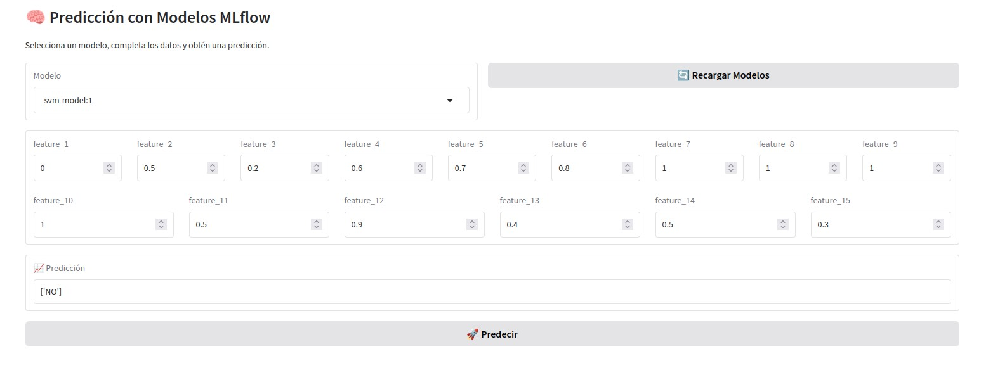

### 1.7 Conclusiones

Se concluye que a traves de kubernetes es posible distribuir la carga de procesos de MLOPS para asi mejorar el rendimiento del proceso de captura y almacenamiento de datos, proceso de entrenamiento, experimentacion, pruebas de estres y despliegue del servicio de inferencia.

En comparacion a disponer el proceso de operaciones en docker, se destaca que es menor la configuracion para establecer las redes internas, no obstante, emerge un reto adicional y es disponibilizar las IP de cada maquin para que los nodos puedas comunicarse entre si. En nuestro caso, se utilizo el servicio de socat, el cual permitio definir las comunicacion entre la ip de cluster de minikube y la ip de cada maquina.

Por otro lado, los servicios de observabilidad permiten identificar el perfomance del proceso de inferencia, con lo que es posible identificar la necesidad de distribuir los servicios entre las maquinas disponibles.

Si bien es cierto que es necesario crear archivos yaml para la configuracion de cada servicios, se resalta la modularidad de cada servicios, los cuales no dependen exclusivamente de la ejecion de un docker compose. Kubernetes permite escalabilidad desde multiples maquinas.

