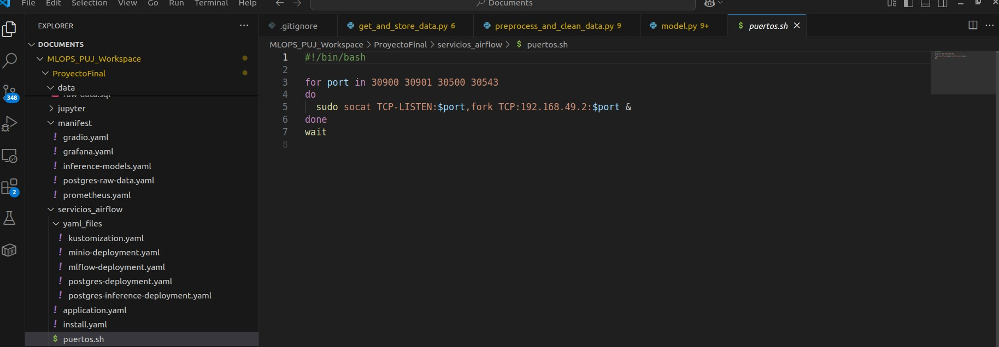
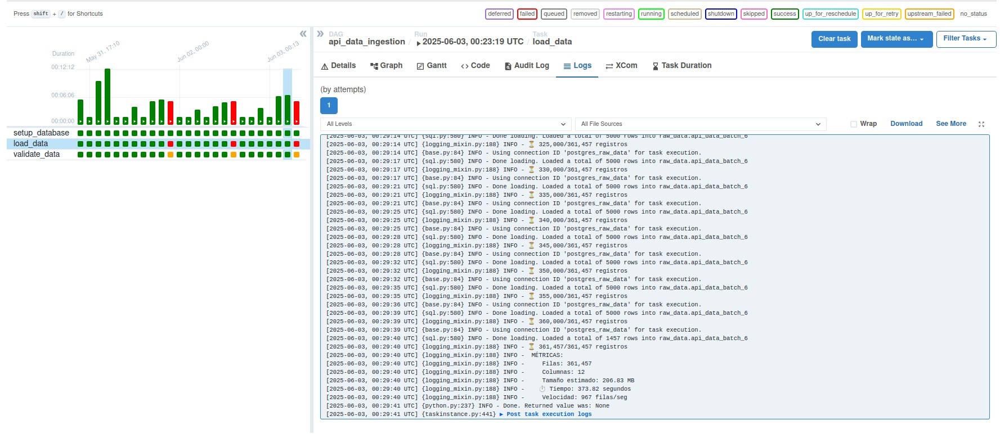
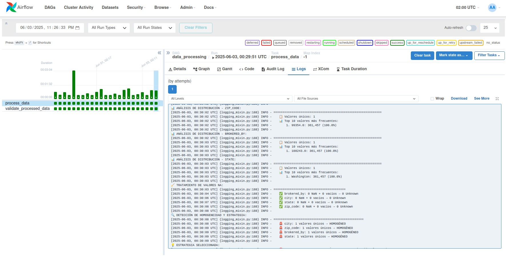
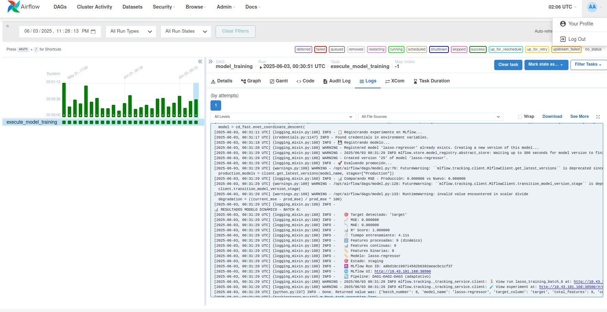
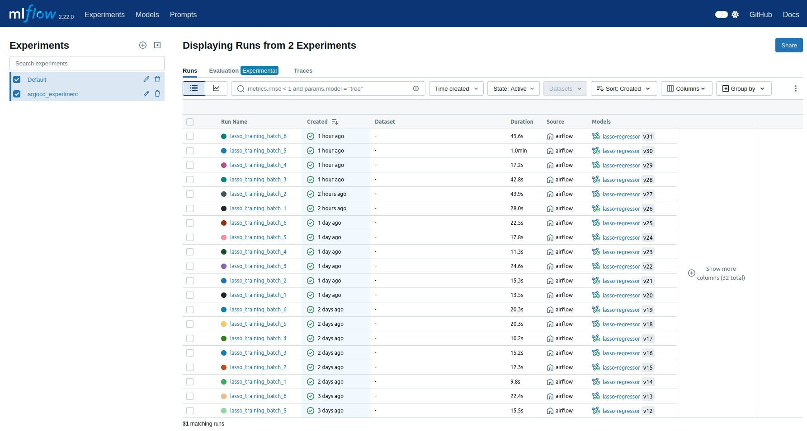
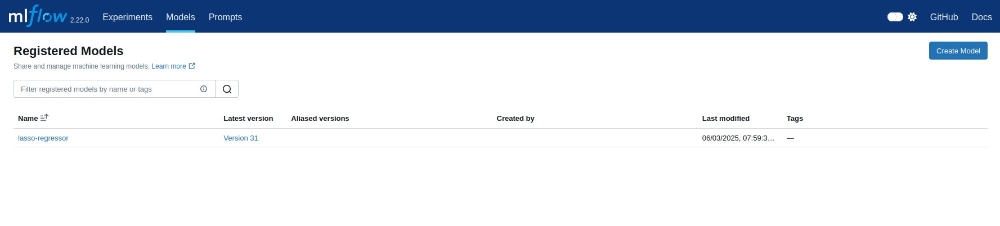
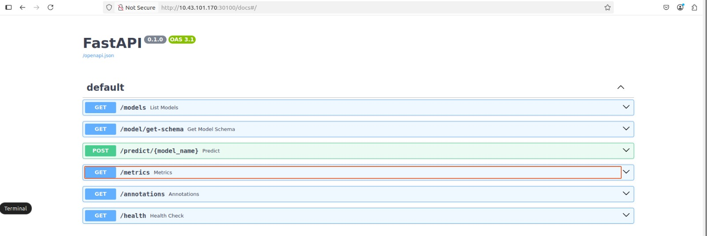
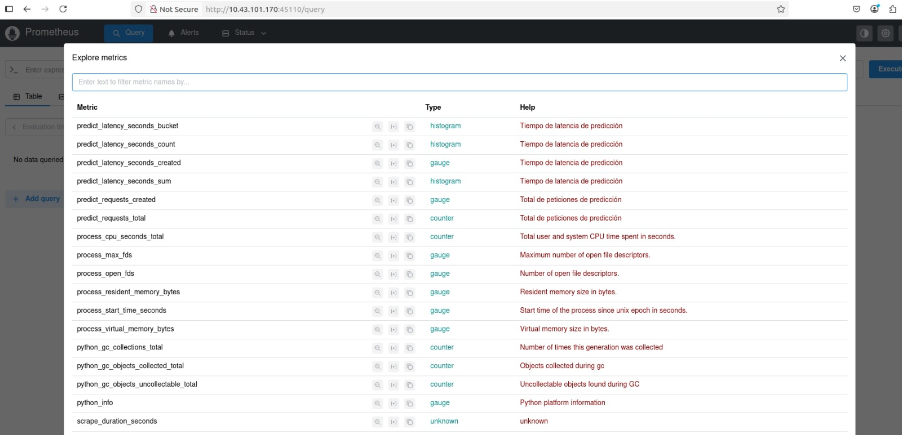
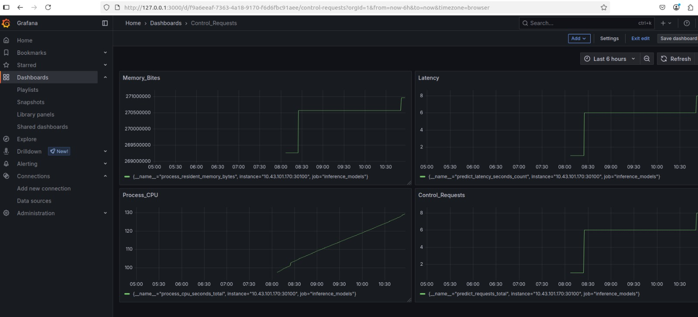
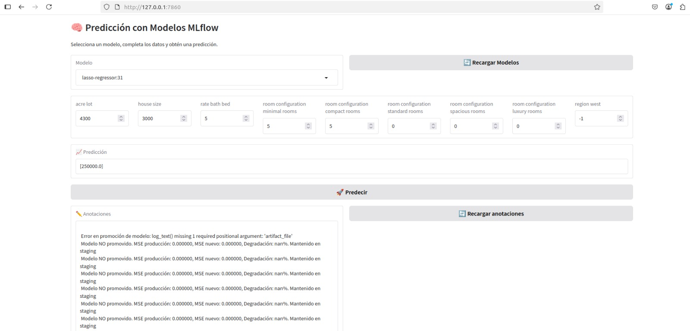

# Proyecto Final

A continuacion se presenta el desarrollo del proyecto final, donde se ha implementado un flujo de MLOps para la inferencia de un modelo de regresión. Los servicios utilizados en el back son PostgreSQL, FASTAPI, Minio, Airflow, Mlflow y Locust. Para la seccion del front se han utilizado Prometheus y Grafana. 

## 0. Estructura proyecto

```
ProyectoFinal/
├── api_read_models/
├── data/
├── jupyter/
├── manifest/
│   ├── gradio.yaml
│   ├── grafana.yaml
│   ├── inference-models.yaml
│   ├── postgres-raw-data.yaml
│   └── prometheus.yaml
├── servicios_airflow/
│   ├── yaml_files/
│   ├── application.yaml
│   ├── install.yaml
│   └── puertos.sh
└── training_model/
    ├── config/
    ├── dags/
    │   ├── __pycache__/
    │   ├── get_and_store_data.py
    │   ├── model.py
    │   ├── orchestrator.py
    │   └── preprocess_and_clean_data.py
    ├── dependencies/
    ├── logs/
    ├── plugins/
    ├── .env
    ├── connect-DB-airflow.sh
    ├── docker-compose.yaml
    └── ports.sh
```

## 1. Servicios

### 1.0 Orquestacion y administracion de servicios

Los servicios seran orquestados con Airflow a traves de la ejecucion secuencial de dags. 

Por su parte, los servicios de Airflow y MLFlow serán administrado con docker compose, mientras que los servicios restantes seran adminsitrados con kubernetes (Minikube).

En una posterior seccion se detallara la configuracion del Airflow y Kubernetes.

### 1.1 Dataset

Los datos para el desarrollo del modelo son de realtor, la cual es una pagina web donde se realiza compra y venta de inmuebles en los EEUU. La variable objetivo es el precio del bien y las variables predictoras son características como tamaño, cantidad de baños, entre otros. El dataset esta compuesto por variables categoricas y cuantitativas. Los datos se consumen de la API disponibilizada por la API http://10.43.101.108/docs a través de un servicio en FASTAPI.

Página web Realtor: https://www.realtor.com/


### 1.2 Kubernetes

Se accede al servicio de kubernetes a traves de Minikube, por consiguente, es necesario realizar la instalacion de minikube

``` curl -LO https://storage.googleapis.com/minikube/releases/latest/minikube-linux-amd64 ```
``` sudo install minikube-linux-amd64 /usr/local/bin/minikube ```

Posteriomente se instala kubectl y se le otorgan permisos, herramienta que permite la interaccion con kubectl

``` curl -LO "https://dl.k8s.io/release/$(curl -s https://dl.k8s.io/release/stable.txt)/bin/linux/amd64/kubectl" ```
``` chmod +x kubectl ```
``` sudo mv kubectl /usr/local/bin/ ```
``` kubectl version --client ```

Tambien se puede utilizar:

 ```sudo snap install kubectl --classic ```

La configuracion de cada servicio se encuentra en archivos en formato yaml. 

En la ruta: ProyectoFinal/servicios_airflow/yaml_files se encuentran los archivos de kubernetes que están asociados al servicio de airflow.

Por su parte, los servicios que se encuentran en la ruta: ProyectoFinal/manifest corresponden al servicio de base de datos que almacena la captura de datos crudos y los datos procesados, al igual que los servicios asociados al proceso de inferencia.

Se inicializa un perfil en minikube

``` minikube start -p mlflowkub ```

Se selecciona el perfil existente

``` minikube profile mlflowkub ```

Se visualiza la Ip del cluster

``` minikube -p mlflowkub ip ```

Una vez creado el cluster y nodo principal, por medio de kubectl se crean los pods y servicios. Para cada uno de los servicios en formato yaml se debe generar la siguiente instruccion:

``` kubectl apply -f <filename_service.yaml> ```

Importante validar que los pods y servicios esten activos y corriendo (running) por medio de la instruccion:

``` kubectl get pods ```

Así mismo, se verifica que los puertos se hayan disponibilizado segun la parametrizacion en los archivo yaml donde se indican los servicios a traves de kubernetes.

``` kubectl get svc ```

Para disponibilizar los puertos a diferentes máquinas que se encuentran conectadas a la misma red (En este caso es posible porque las maquinas virtuales estan en la red de la PUJ), se utilizara socat porque permite la comunicacion bidireccional.

https://www.redhat.com/es/blog/getting-started-socat

Por consiguiente, se procede a instalar socat con los siguientes comandos en terminal:

``` sudo apt-get update ```
``` sudo apt-get install socat  ```

Una vez instalado socat, se procede con la creacion de un archivo en formato sh, donde se establece la comunicacion entre la ip del cluster creado en minikube y la ip de la maquina virtual que permitira el acceso de los otros equipos.



Teniendo en cuenta que se han disponibilizado servicios en multiples maquinas, encontrara multiples archivos ".sh", por consiguiente, para cada archivo en dicho formato es necesario ejecutarlo con la siguiente instruccion:

``` ./<socat_filename.sh> ```

Por ejemplo, el servicio donde se almancenan los datos crudos y procesados es:

``` ./training_model/ports.sh ```

Es importante mencionar que los servicios se disponibilizaron a traves de 3 maquinas, dividos en las siguientes secciones:

    a) Servicios almacenamiento de datos crudos y procesados: MLOPS_PUJ_Workspace/ProyectoFinal/model_training/
       Socat file: ports.sh
    b) Servicios de entrenamiento (mlflow), almacenamiento de objetos (minio), bases de datos de alamacenamiento de metadatos del proceso de entrenamiento e inferencia: MLOPS_PUJ_Workspace/ProyectoFinal/servicios_airflow/yaml_files
        Socat file: puertos.sh
    c) Servicios front y observabilidad: MLOPS_PUJ_Workspace/ProyectoFinal/manifest
        Socat file: puertos.sh
    
Gradio:
10.43.101.168:30675

Grafana:
10.96.125.40:3000

Inference-Models:
10.105.179.116:31538

Prometheus:
10.109.19.255:30690

Minio:
10.101.223.43:30900

MLflow:
10.107.191.197:30500

Postgres:
10.104.2.75:30543

Data:
10.43.101.166:5433


### 1.3 Airflow

El servicio de airflow se levanta por medio de docker compose, por consiguiente es necesario ubicarse en la carpeta que contiene el archivo .yaml con la configuracion de docker:

```cd /Proyecto3/model_training```

Se procede a levantar el servicio de Airflow.

```sudo docker compose up --build```

docker compose exec airflow-scheduler airflow connections add \
    --conn-type postgres \
    --conn-host 10.43.101.166 \
    --conn-login airflow \
    --conn-password airflowpass \
    --conn-port 5433 \
    --conn-schema airflow \
postgres_airflow_conn

En la ruta ProyectoFinal/ se encuentra un archivo de variables de entorno .env, donde se ha parametrizado la conexión automática de airflow con la base de datos que contiene los datos crudos y procesados, al igual que se definieron las credenciales de acceso.

Se accede a airflow con las credenciales:

user: airflow
password: airflow


* 1.3.0: Orden ejecucion de los DAGS:

Airflow contiene 4 DAGs: 1 DAG orquestador y 3 DAGs de procesamiento

    a) mlops_pipeline_orchestrator: Orquestador

    b) api_data_ingestion: Captura y almacenamiento de datos crudos

    c) data_processing: Captura de datos crudos, procesamiento y almacenamiento de datos procesados

    d) model_training: Entrenamiento de modelo que integra mlflow, minio, entre otros.

El DAG orquestador realiza un proceso secuencial, donde se ejecuta la captura de datos, se realiza el procesamiento de datos y entrenamiento de datos. En el marco del presente taller donde la captura de datos es por batches, se realiza el flujo completo antes de iniciar con un nuevo batch. A continuación se brinda detalle sobre cada etapa del proceso.

* 1.3.1 DAG: get_and_store_data.py
  
## Descripción
Pipeline MLOps de ingesta de datos inmobiliarios: API → PostgreSQL con validación automática y análisis estadístico.

**Flujo**: `setup_database` → `load_data` → `validate_data`

## Configuración
- **DAG ID**: `api_data_ingestion`
- **Owner**: `mlops-team`
- **Schedule**: Manual (`schedule_interval=None`)
- **API**: `http://10.43.101.108/data`
- **DB**: PostgreSQL (`postgres_raw_data`)

## Etapas del Pipeline

### 1. SETUP_DATABASE
**Explícita**: Preparación de infraestructura
**Implícitas**:
- Auto-configuración conexión PostgreSQL (`@provide_session`)
- Manejo variables entorno (host, puerto, credenciales)
- Creación schema `raw_data`
- Limpieza tablas previas (`DROP TABLE IF EXISTS`)
- Tabla dinámica: `api_data_batch_{number}`

**Schema**:
```sql
brokered_by, status, price, bed, bath, acre_lot, street, city, 
state, zip_code, house_size, prev_sold_date, created_at



Importante mencionar que bajo la lógica del problema de ejecutar el proceso cada vez que se identifica un nuevo batch, cuando se han recorrido todas las particiones, el proceso de obtención de datos se detiene con sus posteriores etapas.

* 1.3.2 DAG: preprocess_and_clean_data.py 

## Descripción
Pipeline MLOps de procesamiento ETL que transforma datos raw inmobiliarios en features engineered listos para machine learning, con límites adaptativos dinámicos y estrategias automáticas de categorización.

**Flujo**: `process_data` → `validate_processed_data`

## Configuración
- **DAG ID**: `data_processing`
- **Owner**: `mlops-team`
- **Schedule**: Manual (`schedule_interval=None`)
- **Source**: PostgreSQL `raw_data.api_data_batch_{number}`
- **Target**: PostgreSQL `raw_data.api_data_batch_{number}_processed`

## Etapas del Pipeline

### 1. PROCESS_DATA
**Función**: `process_data()`

**Procesos Explícitos**:
- Lectura de datos raw desde PostgreSQL
- Aplicación de procesamiento ETL completo
- Creación de tabla processed con features engineered

**Procesos Implícitos**:

#### A. Setup y Validación Inicial
- Auto-configuración conexión PostgreSQL
- Verificación existencia tabla origen
- Análisis inicial de estructura de datos
- Conteo y validación de registros

#### B. Análisis de Homogeneidad Inteligente
- **Función**: `detect_homogeneous_data_and_apply_strategy()`
- Evaluación automática variables categóricas: `city, zip_code, brokered_by, state`
- Detección de homogeneidad por conteo valores únicos
- Selección estrategia: `alternative` (homogéneo) vs `dynamic` (diverso)

#### C. Cálculo de Límites Adaptativos Dinámicos
- **Función**: `calculate_adaptive_limits()`
- Algoritmo logarítmico continuo basado en tamaño dataset
- Factores de escala específicos: `city_factor=1.0, zipcode_factor=0.4, broker_factor=0.2`
- Límites dinámicos para 5 percentiles: 20%, 40%, 60%, 80%, 95%
- Garantía límites siempre crecientes

#### D. Categorización Dinámica Avanzada
**Variables Procesadas**:
- **Ciudades por Demanda**: `categorize_cities_by_demand()`
  - Categorías: `minimal, very_low, low, mid, mega_demand`
  - Análisis estadístico distribución conteos
  - Límites adaptativos según tamaño dataset

- **Códigos Postales por Transaccionalidad**: `categorize_transactionality_by_zipcode()`
  - Categorías: `minimal, low, mid, high, mega_transactionality_zone`
  - Análisis temporal ventas previas (`prev_sold_date`)
  - Agrupación por año y conteo transacciones

- **Brokers por Tipo**: `categorize_brokered_by_type()`
  - Categorías: `micro_agent, small_agent, agent, large_agent, mega_corporate`
  - Análisis volumen propiedades por broker

- **Regiones Geográficas**: `get_us_region()`
  - Mapeo estados → regiones: `Northeast, Midwest, South, West, Unknown`

#### E. Estrategia Alternativa para Datos Homogéneos
- **Función**: `create_alternative_categories_safe()`
- **SIN usar price** (variable objetivo)
- Categorías basadas en variables numéricas:
  - `property_size_tier`: Quartiles de `house_size`
  - `room_configuration`: Bins de `bed + bath`
  - `lot_size_category`: Quartiles de `acre_lot`
  - `efficiency_tier`: Ratio habitaciones/tamaño

#### F. Limpieza y Transformación Robusta
- **Variables Categóricas**:
  - Manejo completo valores faltantes: `NaN, '', ' ', 'null', 'NULL' → 'Unknown'`
  - Eliminación espacios y normalización strings
  - Merges con parámetros de categorización
  - One-hot encoding con nombres compatibles PostgreSQL

- **Variables Numéricas**: `bed, bath, acre_lot, house_size`
  - Feature engineering: `rate_bath_bed = bath/bed`
  - Transformación logarítmica: `np.log()`
  - Imputación con mediana para valores faltantes
  - Escalado Min-Max normalization

#### G. Inserción Optimizada
- Creación tabla con schema dinámico
- Inserción bulk usando PostgreSQL COPY
- Manejo de tipos de datos numéricos

### 2. VALIDATE_PROCESSED_DATA
**Función**: `validate_processed_data()`

**Procesos Explícitos**:
- Validación final de datos procesados
- Conteo de registros y features
- Verificación integridad del pipeline

**Procesos Implícitos**:
- Query información schema PostgreSQL
- Validación nombres de columnas
- Confirmación completitud del procesamiento

## Características MLOps Avanzadas

### Algoritmos Adaptativos
- **Límites Dinámicos**: Función logarítmica continua escalable
- **Estrategias Automáticas**: Selección basada en homogeneidad
- **Feature Engineering**: Categorización inteligente sin data leakage

### Robustez de Datos
- **Manejo NA**: Tratamiento completo valores faltantes
- **Validaciones**: Verificaciones pre y post procesamiento
- **Escalabilidad**: Algoritmos que escalan con cualquier tamaño dataset

### Optimizaciones de Rendimiento
- **Bulk Insert**: PostgreSQL COPY para inserción masiva
- **Memory Efficient**: Procesamiento por chunks cuando necesario
- **SQL Optimizado**: Queries eficientes para análisis estadísticos

## Variables Entorno
```bash
RAW_DATA_DB_HOST=10.43.101.166
RAW_DATA_DB_PORT=5433
RAW_DATA_DB_NAME=rawdata
RAW_DATA_DB_USER=admin
RAW_DATA_DB_PASSWORD=admin
```



* 1.3.3 DAG: model.py

## Descripción
Pipeline MLOps de entrenamiento automático de modelos Lasso para regresión de precios inmobiliarios, con detección dinámica de features, tracking en MLflow y promoción automática a producción basada en métricas.

**Flujo**: `execute_model_training`

## Configuración
- **DAG ID**: `model_training`
- **Owner**: `mlops-team`
- **Schedule**: Manual (`schedule_interval=None`)
- **Source**: PostgreSQL `raw_data.api_data_batch_{number}_processed`
- **MLflow**: `http://10.43.101.168:30500`
- **MinIO**: `http://10.43.101.168:30900`

## Etapas del Pipeline

### 1. EXECUTE_MODEL_TRAINING
**Función**: `execute_model_training()`

**Procesos Explícitos**:
- Entrenamiento modelo Lasso dinámico
- Tracking experimentos MLflow
- Promoción automática a producción

**Procesos Implícitos**:

#### A. Setup y Configuración
- **Función**: `setup_connection()` + `setup_mlflow()`
- Auto-configuración conexión PostgreSQL
- Configuración MLflow tracking URI
- Creación/validación experimento: `argocd_experiment`
- Setup credenciales MinIO para artifacts

#### B. Validación y Carga Dinámica
- Verificación existencia tabla procesada DAG2: `api_data_batch_{number}_processed`
- Validación datos no vacíos
- Carga completa dataset con estructura dinámica
- Limpieza automática metadatos (`id, created_at`)
- Análisis exploratorio automático

#### C. Detección Automática de Features
- **Target Detection**: Búsqueda automática en candidatos: `['target', 'price', 'y', 'label', 'outcome']`
- **Feature Classification**:
  - Features binarias: valores `{0,1}` o `{True,False}`
  - Features continuas: tipos `float64, int64`
- Separación dinámica X (features) y y (target)
- Validación estructura de datos

#### D. Limpieza y Preparación
- Manejo valores NaN en features (imputación mediana)
- Eliminación filas con target faltante
- División train/test (80/20) con `random_state=42`
- Validación final consistencia datos

#### E. Entrenamiento Modelo Lasso
- **Algoritmo**: Lasso Regression (`alpha=1.0`)
- **Métricas**: MSE, MAE, R² Score
- **Timing**: Medición tiempo entrenamiento
- **Reproducibilidad**: `random_state=42`

#### F. MLflow Tracking Completo
**Parámetros Registrados**:
- Modelo: `model_type, alpha, problem_type, target_column`
- Datos: `batch_number, data_rows, total_features, feature_names`
- Features: `continuous_features, binary_features`
- Pipeline: `data_source, target_detection, feature_detection`
- Estadísticas: `target_min/max/mean/std`
- Entrenamiento: `train_size, test_size, training_time_seconds`
- Metadatos: `airflow_dag_run_id, data_table, upstream_dag`

**Métricas Registradas**:
- `mse`: Mean Squared Error
- `mae`: Mean Absolute Error
- `r2_score`: Coefficient of Determination

**Artifacts**:
- Modelo Lasso: `lasso` artifact path
- Schema: `input_schema.json`
- Signature: Inferida automáticamente
- Logs: `annotations/log.txt`

#### G. Promoción Automática de Modelos
- **Función**: `promote_to_production()`
- **Estrategia**: Comparación MSE con modelo producción actual
- **Estados**: `Production`, `Staging`, `Archived`

**Lógica de Promoción**:
1. **Primer Modelo**: Promoción directa a `Production`
2. **Modelo Mejor**: Si `MSE_nuevo < MSE_producción`
   - Archivar modelo anterior → `Archived`
   - Promover nuevo modelo → `Production`
   - Log mejora porcentual
3. **Modelo Peor**: Si `MSE_nuevo >= MSE_producción`
   - Mantener modelo → `Staging`
   - Log degradación porcentual

#### H. Logging y Auditoría
- Registro detallado de decisiones promoción
- Logs estructura dinámica detectada
- Métricas comparativas entre modelos
- Trazabilidad completa pipeline DAG1→DAG2→DAG3

## Características MLOps Avanzadas

### Detección Dinámica
- **Auto-Discovery**: Features y target detectados automáticamente
- **Flexible Schema**: Adaptación a cualquier estructura DAG2
- **Type Detection**: Clasificación automática tipos features

### Model Management
- **Versioning**: Control versiones automático MLflow
- **Staging**: Estados de modelo estructurados
- **Promotion**: Decisiones basadas en métricas objetivas
- **Rollback**: Capacidad de reversión automática

### Experimentación
- **Tracking**: Registro completo experimentos
- **Reproducibility**: Seeds fijos y parámetros documentados
- **Comparison**: Métricas comparativas entre versiones
- **Artifacts**: Almacenamiento MinIO distribuido

### Integration Pipeline
- **Upstream Dependency**: Validación datos DAG2
- **Batch Processing**: Soporte múltiples batches
- **Error Handling**: Manejo robusto errores con logging

## Variables Entorno
```bash
# PostgreSQL
RAW_DATA_DB_HOST=10.43.101.166
RAW_DATA_DB_PORT=5433
RAW_DATA_DB_NAME=rawdata
RAW_DATA_DB_USER=admin
RAW_DATA_DB_PASSWORD=admin

# MLflow + MinIO
MLFLOW_S3_ENDPOINT_URL=http://10.43.101.168:30900
AWS_ACCESS_KEY_ID=minioadmin
AWS_SECRET_ACCESS_KEY=minioadmin123
```



* 1.3.4 DAG: orchestrator.py

## Descripción
Orquestador principal del pipeline MLOps que ejecuta secuencialmente DAG1→DAG2→DAG3 para todos los batches disponibles, gestionando el flujo completo desde ingesta hasta entrenamiento de modelos con monitoreo automático y validación final.

**Flujo**: `setup_database` → `restart_api` → `execute_batch_pipeline` → `validate_pipeline`

## Configuración
- **DAG ID**: `mlops_pipeline_orchestrator`
- **Owner**: `mlops-team`
- **Schedule**: Diario (`@daily`)
- **DAGs Orquestados**: `api_data_ingestion`, `data_processing`, `model_training`
- **API Restart**: `http://10.43.101.108/restart_data_generation`

## Etapas del Pipeline

### 1. SETUP_DATABASE
**Función**: `setup_database()`

**Procesos Explícitos**:
- Configuración inicial base de datos
- Preparación infraestructura PostgreSQL

**Procesos Implícitos**:
- Auto-configuración conexión PostgreSQL (`@provide_session`)
- Creación schema `raw_data` si no existe
- Validación credenciales y conectividad
- Setup inicial para recibir datos de pipeline

### 2. RESTART_API
**Función**: `restart_api()`

**Procesos Explícitos**:
- Reinicio endpoint API externa
- Preparación fuente de datos

**Procesos Implícitos**:
- Petición GET con parámetros: `group_number=3, day=Tuesday`
- Validación respuesta HTTP (`raise_for_status()`)
- Reset estado API para procesamiento limpio
- Sincronización inicio pipeline

### 3. EXECUTE_BATCH_PIPELINE ⭐ (Núcleo del Orquestador)
**Función**: `execute_batch_pipeline()`

**Procesos Explícitos**:
- Orquestación secuencial DAG1→DAG2→DAG3
- Procesamiento todos los batches disponibles
- Monitoreo estado y métricas

**Procesos Implícitos**:

#### A. Control de Iteración Inteligente
- **Loop Automático**: Procesamiento batches secuenciales (`batch_number = 1, 2, 3...`)
- **Detección Fin**: Error 422 HTTP indica agotamiento datos
- **Contador Éxitos**: Tracking batches procesados exitosamente
- **Métricas Acumulativas**: Total registros y timing global

#### B. Orquestación DAG1 (Ingesta)
- **Trigger**: `trigger_dag(DAG1_ID, conf={'batch_number': batch_number})`
- **Monitoreo Estado**: Polling cada 30 segundos
- **Timeout Control**: Máximo 30 minutos por DAG
- **Detección Fin Datos**: Manejo error 422 como terminación normal
- **Validación Success**: Estado `State.SUCCESS` requerido

#### C. Orquestación DAG2 (Procesamiento)
- **Dependencia**: Ejecuta solo después éxito DAG1
- **Trigger Automático**: Mismo `batch_number` que DAG1
- **Monitoreo Sincronizado**: Polling estado hasta completitud
- **Error Handling**: Fallo DAG2 aborta pipeline batch
- **Validación Datos**: Confirma datos procesados disponibles

#### D. Orquestación DAG3 (Entrenamiento)
- **Dependencia**: Ejecuta solo después éxito DAG2
- **Model Training**: Entrenamiento automático por batch
- **MLflow Integration**: Tracking experimentos automático
- **Production Deployment**: Promoción modelos según métricas
- **Batch Isolation**: Cada batch genera modelo independiente

#### E. Gestión de Estados y Timeouts
- **State Monitoring**: `State.SUCCESS`, `State.FAILED`, `State.RUNNING`
- **Timeout Management**: 30 minutos máximo por DAG
- **Error Recovery**: Distinción entre errores fatales y fin de datos
- **Progress Tracking**: Logs detallados progreso cada batch

#### F. Manejo de Errores Inteligente
- **HTTP 422**: Tratado como fin normal de batches
- **Timeouts**: Error fatal después 30 minutos
- **DAG Failures**: Propagación errores con contexto
- **Batch Isolation**: Error en un batch no afecta siguientes

#### G. Métricas y Auditoría en Tiempo Real
- **Conteo Registros**: Query PostgreSQL por batch procesado
- **Timing Global**: Medición tiempo total pipeline
- **Velocidad Promedio**: Registros/segundo acumulativo
- **Inventory Tracking**: Lista tablas creadas por batch

### 4. VALIDATE_PIPELINE
**Función**: `validate_pipeline()`

**Procesos Explícitos**:
- Validación final resultados pipeline
- Inventario completo datos procesados

**Procesos Implícitos**:
- **Discovery Automático**: Query `information_schema.tables`
- **Clasificación Tablas**: Separación `raw` vs `processed`
- **Conteo Exhaustivo**: Validación registros por tabla
- **Audit Trail**: Verificación completitud pipeline
- **MLflow Validation**: Confirmación experimentos creados

## Características MLOps Avanzadas

### Orquestación Inteligente
- **Sequential Execution**: DAG1→DAG2→DAG3 garantizado
- **Batch Processing**: Procesamiento automático múltiples batches
- **State Management**: Monitoreo estados distribuidos
- **Dependency Resolution**: Validación prerrequisitos automática

### Resilience y Recovery
- **Timeout Control**: Prevención bloqueos indefinidos
- **Error Classification**: Distinción errores normales vs fatales
- **Graceful Termination**: Finalización limpia fin de datos
- **Progress Preservation**: Batches exitosos preservados ante errores

### Monitoring y Observabilidad
- **Real-time Metrics**: Métricas progreso en tiempo real
- **Comprehensive Logging**: Logs detallados cada etapa
- **Performance Tracking**: Velocidad y throughput monitoring
- **Audit Trail**: Trazabilidad completa pipeline

### Scalability
- **Dynamic Batching**: Adaptación automática número batches
- **Resource Management**: Control timeouts y recursos
- **Parallel Safety**: Aislamiento batches para concurrencia futura
- **Database Optimization**: Queries eficientes validación

## Variables Entorno
```bash
RAW_DATA_DB_HOST=10.43.101.166
RAW_DATA_DB_PORT=5433
RAW_DATA_DB_NAME=rawdata
RAW_DATA_DB_USER=admin
RAW_DATA_DB_PASSWORD=admin 
```

### 1.4 MlFlow

MLflow actúa como el **sistema de gestión del ciclo de vida** de modelos en el pipeline MLOps, proporcionando tracking automático, versionado y promoción inteligente de modelos.

#### Configuración
- **Tracking Server**: `http://10.43.101.168:30500`
- **Artifact Store**: MinIO `http://10.43.101.168:30900`
- **Experimento**: `argocd_experiment`

#### Funcionalidades Implementadas

**Experiment Tracking Automático**:
- Registro completo de parámetros: modelo, datos, features detectadas dinámicamente
- Métricas de evaluación: MSE, MAE, R² Score por cada entrenamiento
- Artifacts: modelo Lasso + schema de input inferido automáticamente

**Model Registry con Estados**:
- **Staging**: Modelos nuevos en evaluación
- **Production**: Modelo activo basado en mejor MSE
- **Archived**: Modelos anteriores preservados para rollback

**Promoción Automática Basada en Métricas**:
```python
if current_mse < production_mse:
    # Promover nuevo modelo → Production
    # Archivar modelo anterior
else:
    # Mantener en Staging
```





### 1.5 FASTAPI Inferencia

El mejor modelo es consumido por la API de inferencia que se ha disponibilizado en FASTAPI, donde se encuentra el endpoint para hacer la respectiva inferencia. No obstante, el objetivo es acceder al endpoint a través de locust para evaluar la capacidad de ejecucion del flujo de inferencia.



### 1.6 Visualizacion: Prometheus, Grafana y Gradio

Por medio de prometheus se realiza seguimiento y evalua la trazabilidad de las inferencias ejecutadas con gradio.

Asi mismo, Grafana toma la tabla de datos creada con los registros en mencion y permite visualizarlos en una grafica de series de tiempo, donde se evidencia que por segundo se procesan en promedio 6 inferencias.

Se accede a grafana con las credenciales:
    Usuario:admin
    Contrasena:1234

Por ultimo, se expone el servicio de inferencia Gradio, el cual es la herramienta front con la cual el usuario interactua.







### 1.7 Argo CD y GitOps

ArgoCD actúa como el **motor de despliegue continuo** del pipeline MLOps, implementando GitOps para automatizar el deployment de modelos desde MLflow hacia la infraestructura Kubernetes de producción.

#### Funcionalidad en el Pipeline MLOps

**Continuous Deployment Automatizado**:
- **Detección de Modelos**: Monitoreo automático del MLflow Model Registry
- **Sincronización Git**: Actualización manifests Kubernetes cuando modelos pasan a `Production`
- **Deployment Declarativo**: Despliegue de modelos a través de configuraciones YAML versionadas

**Gestión de Infraestructura ML**:
```yaml
# Manifests gestionados por ArgoCD
├── gradio.yaml              # Interface web modelos
├── grafana.yaml             # Dashboards monitoreo  
├── inference-models.yaml    # APIs de inferencia
├── postgres-raw-data.yaml   # Base de datos
└── prometheus.yaml          # Métricas sistema
```

**Integración con MLflow**:
- **Experimento Dedicado**: `argocd_experiment` para tracking deployments
- **Trigger Automático**: Promoción modelo `Production` → ArgoCD deployment
- **Rollback Capability**: Reversión automática a versiones anteriores
- **Environment Sync**: Consistencia entre staging y producción

**Flujo GitOps Completo**:
MLflow Model Registry → Git Repository Update → ArgoCD Sync → Kubernetes Deployment

**Beneficios Implementados**:
- **Immutable Deployments**: Cada versión modelo desplegada es inmutable y trazable
- **Declarative Configuration**: Estado deseado definido en Git como única fuente de verdad
- **Automated Rollback**: Capacidad de rollback automático ante fallos
- **Multi-Environment**: Gestión consistente entre staging y producción
- **Audit Trail**: Trazabilidad completa de cambios y deployments

**Valor MLOps**:
- **Reduce Manual Errors**: Eliminación deployments manuales
- **Accelerated Delivery**: Deployment automático desde entrenamiento a producción
- **Governance**: Control versiones y aprobaciones estructuradas
- **Reliability**: Deployments consistentes y repetibles

### 1.8 Conclusiones

#### 1.8.1 Pipeline End-to-End Completamente Automatizado
Se implementó un pipeline MLOps robusto que automatiza el flujo completo: **API → Ingesta → Procesamiento → Entrenamiento → Producción**. El orquestador procesa automáticamente múltiples batches secuenciales (DAG1→DAG2→DAG3) sin intervención manual, garantizando escalabilidad y reproducibilidad del proceso de machine learning.

#### 1.8.2 Gestión Inteligente de Features con Límites Adaptativos
El sistema implementa **algoritmos dinámicos** que se adaptan automáticamente al tamaño del dataset para categorización de variables (ciudades, códigos postales, brokers). Esto elimina hard-coding y permite que el pipeline funcione con cualquier volumen de datos, desde datasets pequeños hasta grandes, manteniendo calidad en el feature engineering.

#### 1.8.3 Promoción Automática de Modelos Basada en Métricas
Se estableció un sistema de **model governance automatizado** donde los modelos Lasso se promueven a producción únicamente si superan el MSE del modelo actual. MLflow gestiona automáticamente el versionado, estados (Staging/Production/Archived) y trazabilidad completa, asegurando que solo los mejores modelos lleguen a producción sin intervención manual.

#### 1.8.4 Observabilidad y Monitoreo Integral del Ciclo de Vida ML
El proyecto establece **trazabilidad completa** desde datos raw hasta modelos en producción, integrando Prometheus, Grafana y MLflow para monitoreo en tiempo real. Esto permite detectar drift de datos, degradación de modelos y issues de performance, facilitando el mantenimiento proactivo y debugging rápido en entornos productivos.

#### 1.8.5 Aceleración Significativa del Time-to-Market
La automatización elimina el **deployment manual** de modelos, reduciendo el tiempo desde desarrollo hasta producción de semanas a horas. El pipeline orquestado permite iteraciones rápidas, A/B testing automático entre modelos y rollback inmediato, acelerando la innovación y respuesta a cambios del negocio.

#### 1.8.6 Estandarización de Procesos MLOps Empresariales
El framework desarrollado establece **mejores prácticas replicables** para cualquier proyecto ML: estructura de DAGs modular, separación clara de responsabilidades (ingesta/procesamiento/entrenamiento), y patrones de infraestructura como código. Esto facilita la adopción de MLOps a nivel organizacional y reduce la curva de aprendizaje para nuevos equipos.