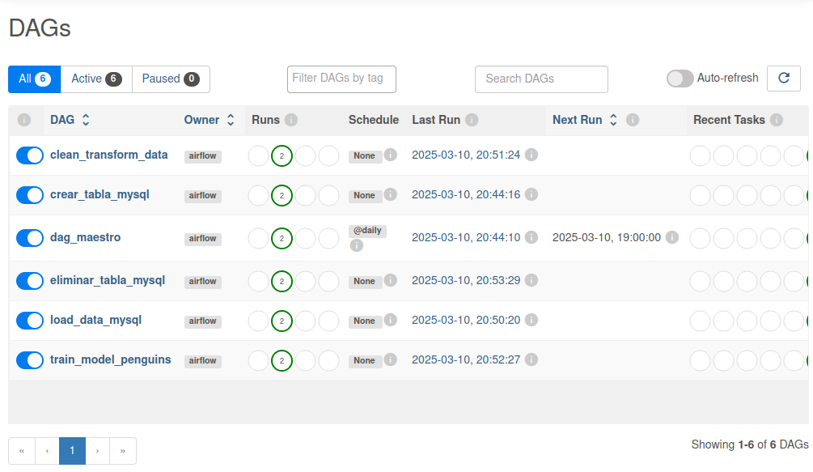
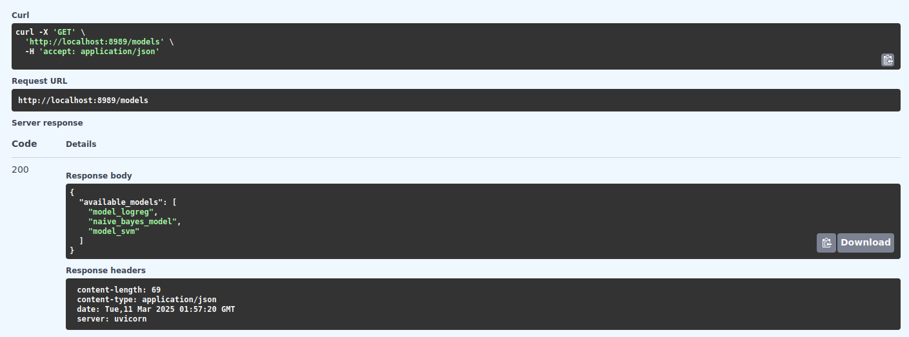

## Taller 3 - Apache Airflow :computer: #
Para este taller se propone el uso del orquestador Apache Airflow 2.6.0 con el fin de llevar a cabo los siguientes puntos:

- Crear una instancia de una base de datos mysql.

- Crear una instancia de Airflow.

- Crear los DAG necesarios que permitan:
  - Borrar contenido base de datos.
  - Cargar datos de penguins a la base de datos, sin preprocesamiento.
  - Realizar preprocesamiento para entrenamiento de modelo.
  - Realizar entrenamiento de modelo usando datos preprocesados de la base de datos.

- Crear una API que permita realizar inferencia al modelo entrenado

## :mega: ATENCIÓN: Este taller se está ejecutando dentro de la máquina 10.43.101.168 de forma temporal :mega: ##

## Configuración de la base de datos :floppy_disk: #
Para configurar la base de datos **MySQL** dentro de **Apache Airflow** sigue estos pasos: 
1. Abre la interfaz gráfica de Airflow ```http://localhost:8080/home```.
2. Ve a **Admin --> Connections**
3. Agrega una nueva conexión:
   - **Conn ID:** ```mysql_airflow_conn```
   - **Conn Type:** ```MySQL```
   - **Host:** ```mysql```
   - **Schema:** ```airflow```
   - **Login:** ```airflow```
   - **Password:** ```airflow```
   - **Port:** ```3306```


## :arrow_right: DAGs :arrow_right: #

Para mantener la modularidad durante el taller se propone un **DAG** por cada requerimiento y un **DAG maestro** encargado de dirigir de forma secuancial los DAGs primarios.


Antes de correr el **DAG maestro** asegúrate de encender todos los DAGs en la vista DAGs de Airflow.



## API Read Models :computer:

Al ejecutarse el DAG *train_model* se guarda un archivo de extensión .pkl dentro de la carpeta */models*. Esta carpeta se encuentra conectada con el servicio independiente de FastAPI que se encuentra corriendo en la URL ```http://localhost:8989/docs#```. El servicio lee todos los archivos en formato .pkl que se encuentran dentro de la carpeta, carga el modelo seleccionado por el usuario y predice la especie del pinguino cuya información es suministrada en los parámetros del método **POST predict/{model_name}**.





