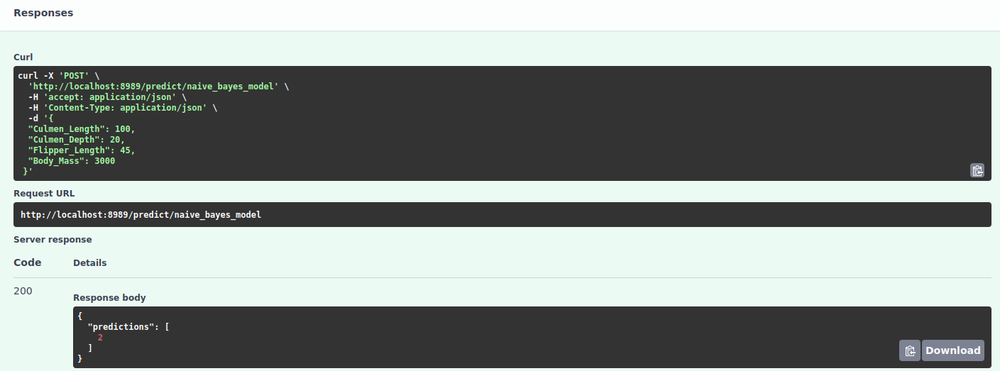

## Taller 3 - Apache Airflow :computer: #
Para este taller se propone el uso del orquestador Apache Airflow 2.6.0 con el fin de llevar a cabo los siguientes puntos:

- Crear una instancia de una base de datos mysql.

- Crear una instancia de Airflow.

- Crear los DAG necesarios que permitan:
  - Borrar contenido base de datos.
  - Cargar datos de penguins a la base de datos, sin preprocesamiento.
  - Realizar preprocesamiento para entrenamiento de modelo.
  - Realizar entrenamiento de modelo usando datos preprocesados de la base de datos.

- Crear una API que permita realizar inferencia al modelo entrenado

- Ejecución:
  - Descargue o clone el repositorio en la máquina donde desea implementar la imagen.
  - Es importante que en la carpeta taller3 exista una carpeta denominada logs, en caso que no exista, por favor crearla de forma manual.
  - Ejecutar la imagen con: docker compose up --build
  - Acceder a airflow tal como lo describe la sección: Configuración de la base de datos.
  - Ejecutar airflow tal como lo menciona la sección: DAGs
  - Realizar la inferencia del modelo como lo menciona la sección: API Read Models


### :mega: ATENCIÓN: Este taller se está ejecutando dentro de la máquina 10.43.101.168 de forma temporal :mega: ###


## Configuración de la base de datos :floppy_disk: #
Para configurar la base de datos **MySQL** dentro de **Apache Airflow** sigue estos pasos: 
1. Abre la interfaz gráfica de Airflow ```http://localhost:8080/home```.
2. Ve a **Admin --> Connections**
3. Agrega una nueva conexión:
   - **Conn ID:** ```mysql_airflow_conn```
   - **Conn Type:** ```MySQL```
   - **Host:** ```mysql```
   - **Schema:** ```airflow```
   - **Login:** ```airflow```
   - **Password:** ```airflow```
   - **Port:** ```3306```


## :arrow_right: DAGs :arrow_right: #

Para mantener la modularidad durante el taller se propone un **DAG** por cada requerimiento y un **DAG maestro** encargado de dirigir de forma secuancial los DAGs primarios.


Antes de correr el **DAG maestro** asegúrate de encender todos los DAGs en la vista DAGs de Airflow.


## API Read Models :computer:

Al ejecutarse el DAG *train_model* se guarda un archivo de extensión .pkl dentro de la carpeta */models*. Esta carpeta se encuentra conectada con el servicio independiente de FastAPI que se encuentra corriendo en la URL ```http://localhost:8989/docs#```. El servicio lee todos los archivos en formato .pkl que se encuentran dentro de la carpeta, carga el modelo seleccionado por el usuario y predice la especie del pinguino cuya información es suministrada en los parámetros del método **POST predict/{model_name}**.





## Conclusiones:

El desarrollo del presente taller conlleva al planteamiento de las siguientes afirmaciones:

1. Es eficiente el uso de un dag orquestador en airflow si los dags que ejecuta el orquestador solo contienen una tarea.
2. El uso de airflow y motores de bases de datos (como mysql) requiere que se parametrice la conexión, tal como se indican en las instrucciones al inicio del documento.
3. Es clave la identificación de las rutas donde se disponibilizan los archivos porque de esa manera se minimiza la materilización de un error operativo al momento de construir los volumenes de los contenedores.
4. Si el proceso de airflow no lo requiere, indicar una instrucción para que sólo se realice la ejecución desde el día anterior, al igual que parametrizar los dags contenido por el orquestador como activación manual. Lo anterior permite que el orquestador tenga total control de la ejecución y que se realicen solo las ejecuciones deseadas. Así se reduce el costo computacional y tiempo de espera. De igual forma, para el taller presentado, se ha asignado un orden secuencial para evitar el solapamiento de tareas.
5. La ejecución del contenedor crea una carpeta de denominada logs, donde es posible validar el estado de la ejecución y tener un plan de acción ante la materialización de errores.
6. Por último, se identifica con el trabajo realizado, la oportunidad de implementar múltiples modelos bajo un flujo de trabajo definido, al igual que es posible hacer escalables los modelos a un usuario con conocimiento bajo-intermedio en ciencia de datos.


