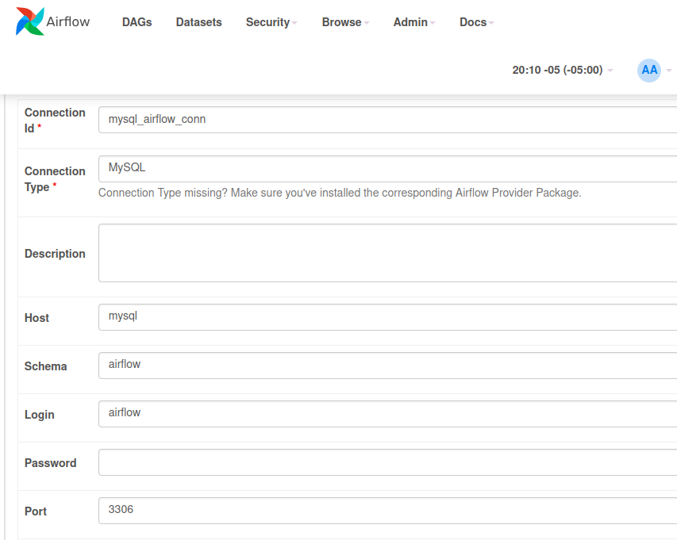
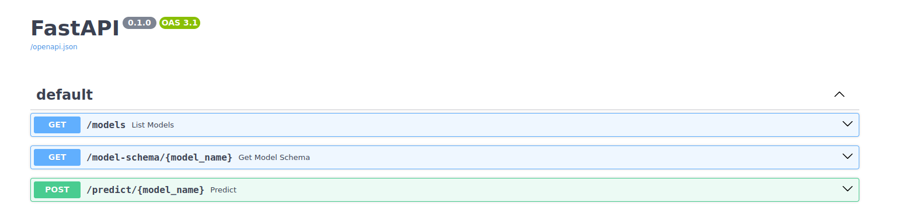

## Taller 3 - Apache Airflow :computer: #
Para este taller se propone el uso del orquestador Apache Airflow 2.6.0 con el fin de llevar a cabo los siguientes puntos:

- Crear una instancia de una base de datos mysql.

- Crear una instancia de Airflow.

- Crear los DAG necesarios que permitan:
  - Borrar contenido base de datos.
  - Cargar datos de penguins a la base de datos, sin preprocesamiento.
  - Realizar preprocesamiento para entrenamiento de modelo.
  - Realizar entrenamiento de modelo usando datos preprocesados de la base de datos.

- Crear una API que permita realizar inferencia al modelo entrenado


## Configuración de la base de datos :floppy_disk: #
Para configurar la base de datos **MySQL** dentro de **Apache Airflow** sigue estos pasos: 
1. Abre la interfaz gráfica de Airflow ```http://localhost:8080/home```.
2. Ve a **Admin --> Connections**
3. Agrega una nueva conexión:
   - **Conn ID:** ```mysql_airflow_conn```
   - **Conn Type:** ```MySQL```
   - **Host:** ```mysql```
   - **Schema:** ```airflow```
   - **Login:** ```airflow```
   - **Password:** ```airflow```
   - **Port:** ```3306```



## :arrow_right: DAGs :arrow_right: #


## API Read Models :computer:




