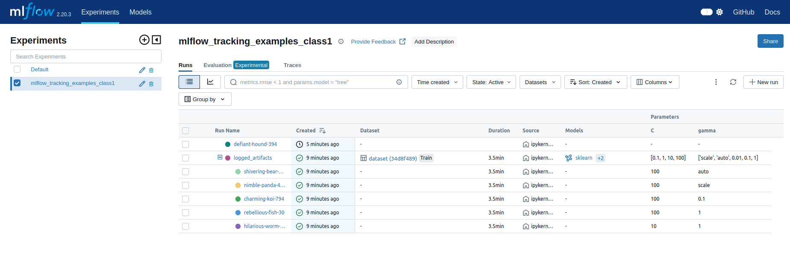
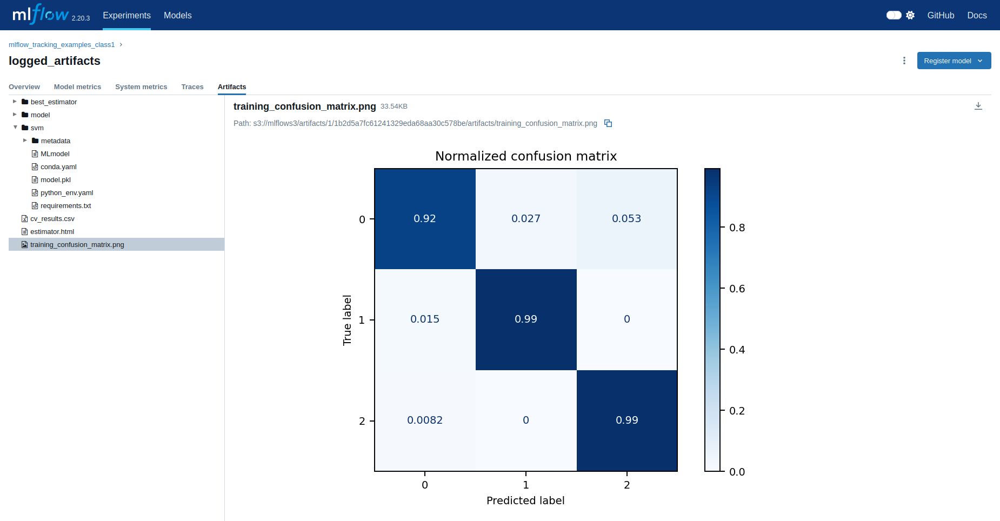
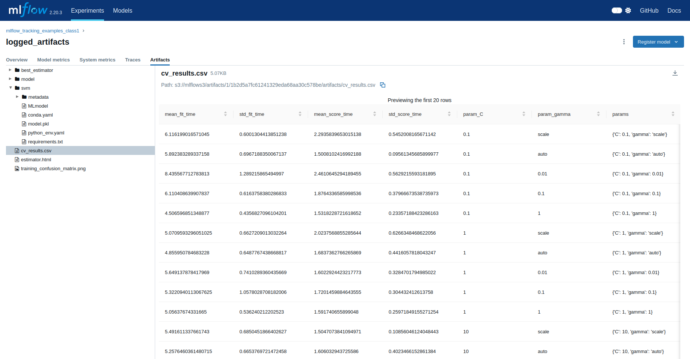
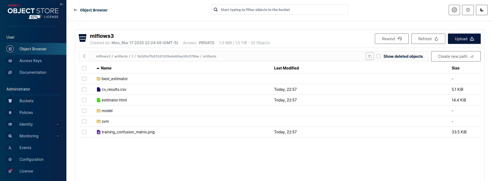

# TALLER MLFLOW #

## Configuración del entorno de trabajo :wrench: ##

En este ejercicio se comunican vía internet 3 servicios distintos:
- Un bucket de Minio (puerto 9000)
- Un entorno jupyter lab (puerto 8080)
- MLFlow (puerto 5000)

Para ejecutar adecuadamente los 3 servicios sigue estos pasos:
1. **Minio & mysql:**
   - Abre una terminal en el directorio *mysql_minio* y ejecuta el archivo .yaml usando el comando ```docker compose up -d ```
   - Accede al servicio minio usando el enlace ``` http://localhost:9000```
   - Ingresa las credenciales para acceder a minio:
     - **usuario:** admin
     - **contraseña:** supersecret
   - Una vez dentro de la plataforma crea un nuevo bucket con el nombre **mlflows3**. En este contenedor se almacenarán los artefactos que se creen en *MLFlow*.
   - Asegurate de dejar encendidos todos los interruptores al configurar el bucket.

2. **MLFlow:**
   - Ingresa al directorio *mlflow* y abre en el editor el archivo *mlflow_service.service*
   - Edita la variable *WorkingDirectory* con las ruta a las carpeta donde clonaste este repositorio.
   - Reemplaza en las variables *MLFLOW_S3_ENDPOINT_URL* y *backend-store-uri* la IP por la IP de tu máquina.
   - Refresca el daemon usando en terminal el comando ``` sudo systemctl daemon-reload ```
   - Habilita y valida el servicio utilizando ```sudo systemctl enable /ruta-a-la-carpeta-mlflow/mlflow_serv.service ``` y ```sudo systemctl start mlflow_serv.service ```.
   - Verifica que *mlflow* está corriendo usando el comando ```sudo systemctl status mlflow_serv.service ```.
   - Ingresa a tu navegador a la dirección ``` http://localhost:5000```. Allí te deberá cargar la interfaz de *mlflow*.

3. **jupyterlab y fastapi:**
   -  Para subir el servicio de *jupyterlab* accede a la carpeta *jupyter_api* y ejecuta el archivo .yaml usando el comando ```docker compose up -build ``` desde la terminal.
   - Accede al link que aparecerá en la terminal una vez se haya creado el contenedor.
   - De igual forma, fastapi se despliega con el docker compose mencionado en el primer numeral de la presente seccion. Ingresa a tu navegador a la dirección ``` http://localhost:8000/docs```
   - En primera instancia se abordara el proceso de entrenamiento y por ultimo, se realizara la inferencia del modelo con fastapi.

## Entrenamiento del modelo y captura de información :computer: ##

Para encontrar el notebook base de este ejercicio dirígete a la carpeta app --> train_models.ipynb. Dentro del notebook se ejecutan los siguientes pasos:

- Creación de tablas dentro de la base de datos *mysql*
- Carga de datos crudos a *mysql*
- Preprocesamiento de datos
- Entrenamiento de modelos utilizando MLFlow:
  - Configuración de variables de entorno que apuntan al servicio de *MLFlow*. El servicio de *MLFlow* se conecta con un bucket de almacenamiento de minio, por ello, es necesario ingresar las credenciales de acceso mencionadas en el numeral 1, al igual que se debe ingresar la IP de la maquina donde se esta realizando la ejecucion.

  Considerar las siguiente variables a partir de la reciente explicacion:

  os.environ['MLFLOW_S3_ENDPOINT_URL'] = "http://insert_ip:9000"

  os.environ['AWS_ACCESS_KEY_ID'] = 'admin'

  os.environ['AWS_SECRET_ACCESS_KEY'] = 'supersecret'

  - En la siguiente ejecucion, se realiza el entrenamiento del modelo y se guardan los artefactos de mlflow en minio. Importante indicar la IP de la maquina donde se realiza la ejecucion para definir el tracking de mlflow, al igual que se indica el nombre del experimento. Importante considerar que el modelo se registra bajo el nombre *svm-model*.
  Dicho nombre es relevante para realizar la conexion con fastapi, tener en cuenta si se realiza el cambio del mismo.

  mlflow.set_tracking_uri("http://insert_ip:5000")

  mlflow.set_experiment("mlflow_tracking_examples")
 
  - El experimento de entrenamiento contempla ejecución que considera 4 hiperparámetros para *C* y 5 parámetros *gamma*. En total, se realiza la ejecucion de 20 modelos *SVM*.

  - Las siguientes imagenes exponen como se almacena la informacion en minio y como se evidencia el registro de experimentos en mlflow. En el notebook se ha incluido la opcion de descargar el modelo pkl desde el bucket, el cual se guarda en un volumen que se conecta con fastapi. Si bien es cierto que no es el objetivo principal del presente taller, se disponibiliza la alternativa, la cual es funcional. Importante ingresar la ruta donde esta guardado el archivo pkl (modelo) en la carpeta de artefactos en minio. As[i mismo, ingresar las credenciales de minio.]

   

   

   

  - Configuración de variables de entorno que apuntan al servicio *minio*
  - Creación cliente *minio*.

   

  - En el notebook se establece el paso a producción del mejor modelo *SVM* encontrado (este paso se realiza en la interfaz de *mlflow*). Al igual que se establece el tracking_uri. El argumento del metodo en mencion es la IP con el puerto 5000.

  mlflow.set_tracking_uri("http://insert_ip:5000")

  - Request al modelo productivo disponible en *mlflow* para verificar funcionamiento. 

  - Opcion de eliminar las tablas de mysql.

  ## Inferencia del modelo con fastapi :computer: ##

  - **Recuerda actualizar tu IP en el archivo *readme.py* que despliega la API.**

  - La inferencia en fastapi contempla dos secciones:

   - La primera seccion expone los nombres de los modelos, el estado de despliegue en el que se encuentren (produccion, staging o sin estado). 

   - En la segunda seccion se realiza la inferencia, donde se ingresa el nombre del modelo y la version a ejecutar. Una vez ingresada la informacion mencionada, se ingresan los valores para realizar la estimacion.

   - La inferencia de fastapi establece conexion con el modulo model registry de mlflow, el cual no requiere de la implementacion de volumenes para la transmision de informacion.


4. **Conclusiones:**

   La integracion de jupyterlab con mlflow permite la ejecucion de multiples modelos, estableciendo un control de versiones y el estado de despliegue de cada modelo. Muestra de ello es la posibilidad de tener control de los modelos en staging o produccion. Asi mismo, es posible experimentar y generar despliegues rapidos a fastapi para realizar iteraciones y mejoras a los modelos.

   Por otro lado, se resalta la versatilidad de mlflow para combinarse con otras herramientas, dado que tiene endpoints con databricks y herramientas cloud, al igual que permite analizar mediante las metricas el performance de los modelos. Por ultimo, el almacenamiento en minio permite almacenar informacion relevante como metadata, pesos, etc.
