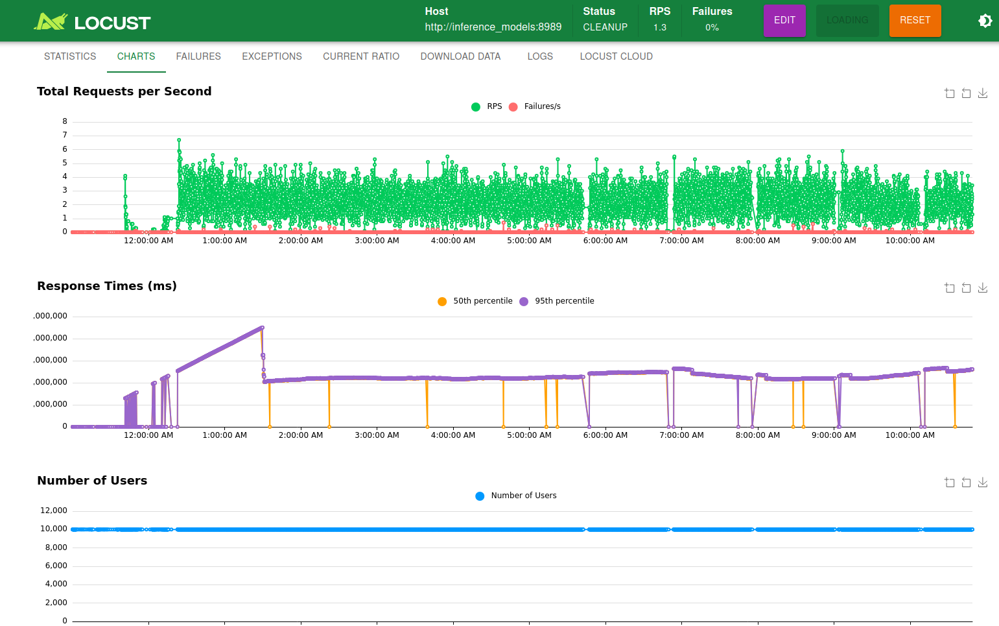
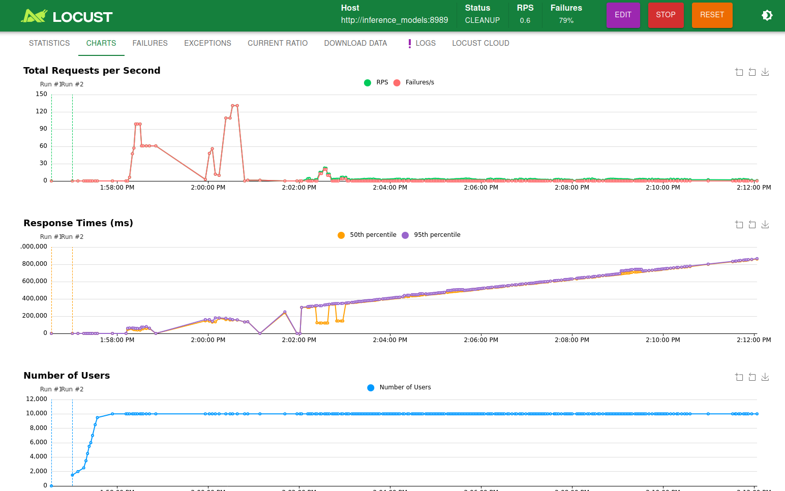
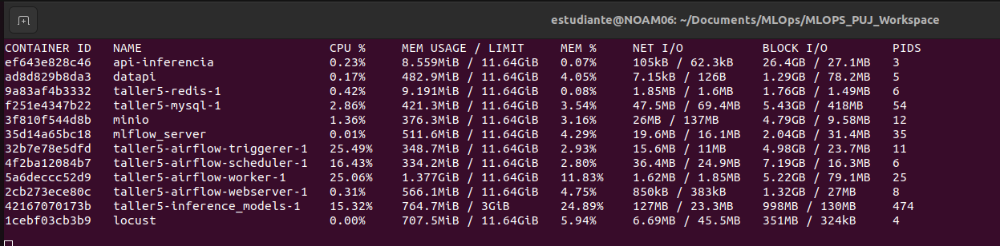
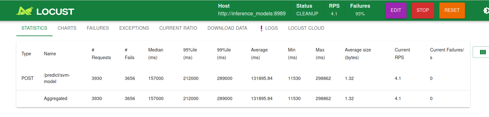
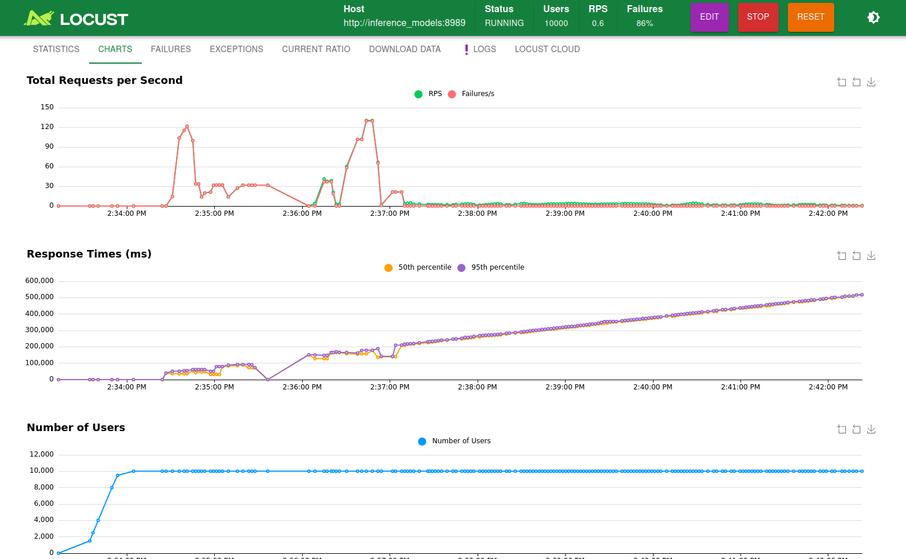
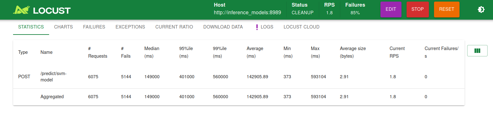
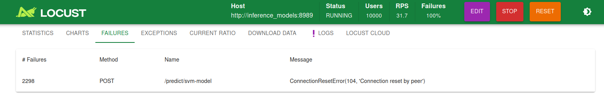

# Taller # 5 - Pruebas de carga con locust

el servicio de locust se construye en un docker compose difererente a los demás servicios. Es por esto que se hace necesario conectar mediante redes docker los dos docker compose. Para ello debes ejecutar la siguiente sentencia:

``` docker network create --driver bridge my_shared_network``` 

## Pruebas con una sola instancia del servicio API

La primera prueba realizada se hizo limitando a **10 gigas** la memoria del servicio. Como la memoria disponible para toda la máquina virtual es de 16 gigas y, además, servicios adicionales como mlflow y airflow se encontraban corriendo tambien, la interfaz gráfica de la misma perdió conexión al ejecutarse el test de 10.000 usuarios con 500 peticiones en simultáneao.



Entonces se optó por realizar la misma prueba, pero esta vez limitando la memoria a solo 3 gigas.





Una tercera prueba se ejecutó limitando aún mas la memoria, esta vez a 700 megas.





## Pruebas con más de una instancia del servicio API

Acto seguido, para mejorar el rendimiento de la API a tan alta demanda de peticiones...


