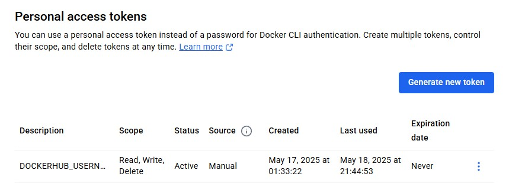
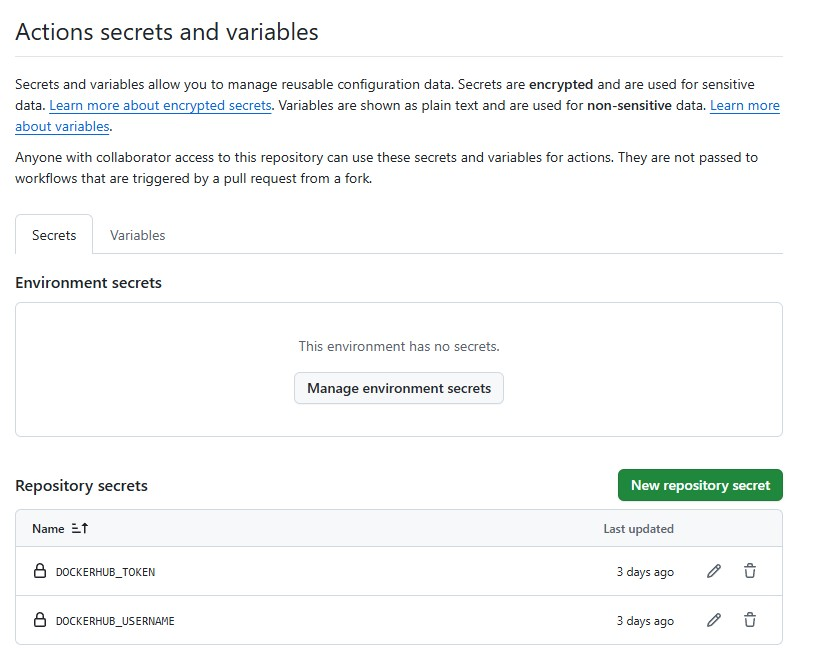
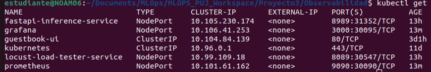
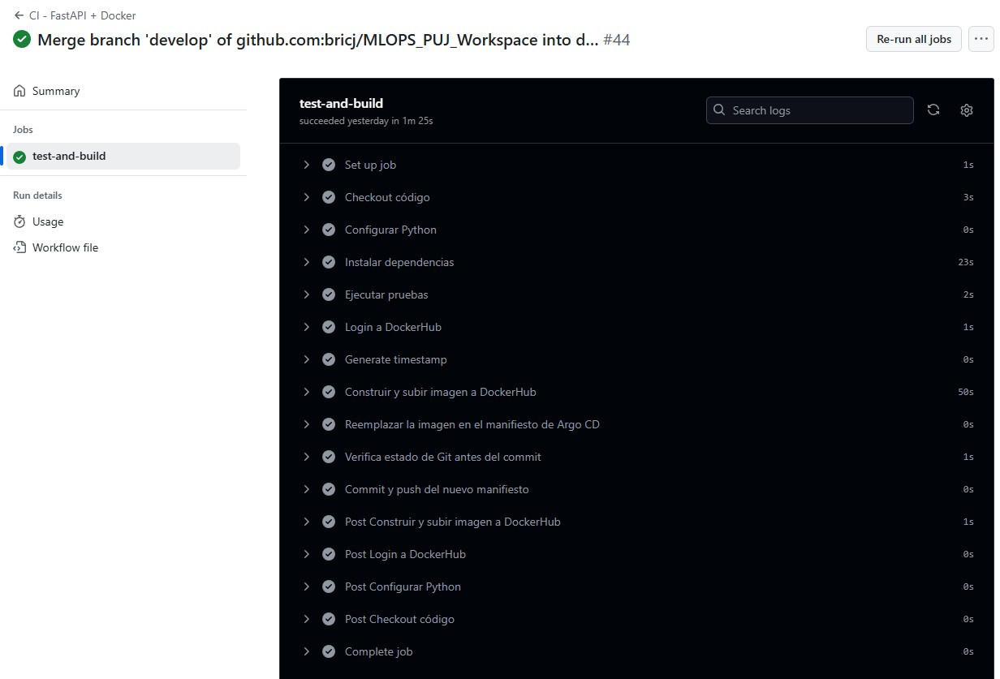
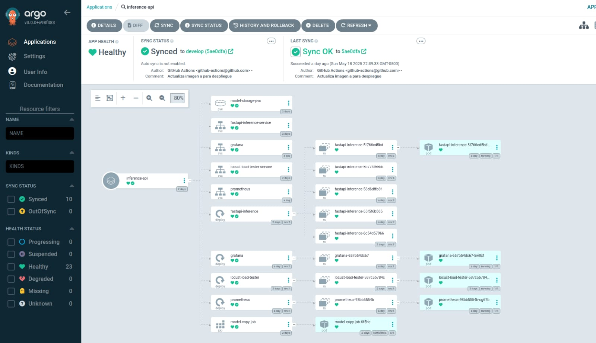

# Taller No. 6

Este proyecto implementa un flujo completo de MLOps (DevOps para Machine Learning) utilizando un enfoque GitOps con CI/CD automatizado. La arquitectura permite el desarrollo, prueba y despliegue continuos de modelos de machine learning en un entorno de Kubernetes.

## 1. Arquitectura

La arquitectura implementa:

### Elementos CI/CD

- **Continuous Integration (CI)** con GitHub Actions
- **Continuous Delivery (CD)** con ArgoCD
- **GitOps** como metodología para gestionar la infraestructura
- **Kubernetes** como plataforma de orquestación

### Componentes principales

- **FastAPI**: API REST para servir predicciones del modelo
- **Docker**: Contenerización de la aplicación
- **GitHub Actions**: Automatización de pruebas, construcción y publicación de imágenes
- **Minikube**: Clúster de Kubernetes local para desarrollo
- **ArgoCD**: Despliegue continuo basado en GitOps
- **Locust**: Pruebas de carga para la API
- **Modelo ML**: El entrenamiento del modelo se realiza mediante el archivo train_model.py

### Consideraciones

- **Imagenes Docker**: En Dockerhub se han almacenado dos imagenes:

    * taller6-fastapi-ml-api: Corresponde a la imagen del proceso de entrenamiento y despliegue FastAPI

    * model-loadtester: Corresponde a la imagen asociada a locust

    Las imagenes en referencia corresponden a la etapa de CI, donde se garantiza el entrenamiento del modelo, disponibilidad para inferencia a traves del endpoint y evaluacion de carga. Por consigueinte, el proceso de github actions se encarga de garantizar la actualizacion de las iamgenes como se indica a continuacion.

### Flujo CI/CD

1. **Desarrollo**:
   - El desarrollador realiza cambios en el código
   - Se hace commit y push a la rama `develop`

2. **Integración Continua (GitHub Actions)**:
   - Se ejecutan las pruebas automatizadas
   - Se construye la imagen Docker con un tag de fecha y hora
   - Se publica la imagen en DockerHub con un tag fecha y hora
   - Se actualiza el manifiesto de Kubernetes con la nueva imagen a partir del tag fecha y hora

    Kubernetes es declarativo, es decir, se actualiza cuando detecta cambios en el yaml. Si actualizamos la imagen pero usamos el mismo nombre y el mismo tag, kubernetes no va a saber que debe actualizar el yaml con la nueva imagen. Por eso en cada ejecución de GitHub actions, publicamos una nueva imagen con un tag diferentes, y ponemos ese tag en el yaml. El yaml al ser cambiado con un nuevo tag, causa que kubernetes detecte un cambio y actualice el servicio o despliegue

    La estrategia utilizada fue la siguiente:

    - name: Generate timestamp
    - id: timestamp
    - shell: bash
    - run: echo "tag=$(date +'%Y-%m-%d-%H-%M-%S')" >> $GITHUB_OUTPUT

    En el Shell generamos un tag con la fecha y hora actual y lo enviamos como salida del action

    luego a la hora de publicar la imagen y de actualizarla en el yaml, podemos usar la variable de salida de ese action de la siguiente forma:

    ```${{ steps.timestamp.outputs.tag }}```

   - Se hace commit de los cambios al repositorio

3. **Entrega Continua (ArgoCD)**:
   - ArgoCD detecta los cambios en los manifiestos (tag fecha y hora)
   - Sincroniza automáticamente los cambios con el clúster
   - Despliega la nueva versión de la aplicación

### Estructura del proyecto

```
Taller6/
├── api/                    # Código de la API FastAPI
│   ├── app/                # Código principal de la aplicación
│   ├── data/               # Datos y modelos entrenados
│   ├── tests/              # Pruebas unitarias
│   ├── Dockerfile          # Configuración de contenedor
│   ├── requirements.txt    # Dependencias Python
│   └── train_model.py      # Script de entrenamiento de modelo
├── loadtester/             # Configuración de Locust para pruebas de carga
│   ├── docker-compose.yaml
│   ├── Dockerfile
│   ├── locust.py
│   └── requirements.txt
├── prometheus/  
│   ├── prometheus.yaml
│   └── Dockerfile
├── tests/             # Configuración de Pruebas
│   ├── api_test.py    # Test de pruebas para CI/CD
├── install.yaml       # Archivo para instalar ARGO CD
└── manifest/               # Manifiestos de Kubernetes
    ├── api-deployment.yaml
    ├── locust-deployment.yaml
    ├── script-deployment.yaml
    └── kustomization.yaml  # Configuración de Kustomize
    └── grafana-deployment.yaml 
    └── grafana-service.yaml 
    └── prometheus-deployment.yaml 
    └── prometheus-services.yaml 
    └── script-deployment.yaml 

```

### Requisitos previos

- Docker
- Kubernetes (Minikube para desarrollo local)
- kubectl
- ArgoCD
- Cuenta en GitHub
- Cuenta en DockerHub

## 2. Instalación y configuración

### Configurar GitHub Actions

1. Crear los siguientes secretos en el repositorio:
   - `DOCKERHUB_USERNAME`: Tu usuario de DockerHub
   - `DOCKERHUB_TOKEN`: Tu token de acceso a DockerHub



De igual forma, es necesario habilitar los secretos de github actions:



Los secretos se incluyen en el archivo del flujo ci/cd.

2. Crear el archivo workflow en `.github/workflows/ci-cd.yml` con el contenido proporcionado.


### Configurar Kubernetes

* Otorgar permisos

    sudo usermod -aG docker $USER

    newgrp Docker

* Inicializar minikube

    minikube start --driver=Docker

* Descarga la última versión de minikube

    curl -LO "https://dl.k8s.io/release/$(curl -s https://dl.k8s.io/release/stable.txt)/bin/linux/amd64/kubectl"

* Asigna permisos de ejecución

    chmod +x kubectl

* Crear servicio para cada manifiesto, a continuacion se indica un ejemplo:

    kubectl apply -f locust-deployment.yaml

    kubectl apply -f api-deployment.yaml

    ...

Es necesario validar que los servicios se encuentren activos o corriendo en minikube:

    kubectl get deployments

    kubectl get pods

    kubectl get services

A continuacion, se indica un ejemplo para acceder a la URL, se debe validar para cada servicio:

    minikube service locust-load-tester-service --url

    ...


### Configurar ArgoCD

1. Instalar ArgoCD en el clúster:
   ```bash
   kubectl create namespace argocd
   kubectl apply -n argocd -f https://raw.githubusercontent.com/argoproj/argo-cd/stable/manifests/install.yaml
   ```

2. Esperar a que todos los pods estén listos

    kubectl wait --for=condition=Ready pods --all -n argocd --timeout=300s

3. Crear la aplicación en ArgoCD:
   ```bash
   kubectl apply -f Taller6/argocd/application.yaml
   ```

4. Obtener la contraseña inicial:
   ```bash
   kubectl -n argocd get secret argocd-initial-admin-secret -o jsonpath="{.data.password}" | base64 -d
   ```

5. Acceder a la interfaz de ArgoCD:
   ```bash
   kubectl port-forward svc/argocd-server -n argocd 8080:443
   ```

### Configurar github actions

Para el proceso de integración continua (CI) se hizo uso de la herramienta GitHub Actions disponible dentro de Github. En primer lugar, se creó sobre la raíz del repositorio el workflow taller6-ci.yml dentro de la ruta .github/workflows/.

Luego, se agregaron 2 condiciones para que se lleve a cabo su ejecución. La primera de ellas es que se ejecute únicamente cuando se está haciendo push a la rama develop (esto para las pruebas que realizamos como equipo). La segunda condición es que se ejecutara cuando el usuario que hiciera push al repositorio NO fuera el bot de github.

Cuando estas dos condiciones se cumplen se ejecutan los siguientes pasos:

1.	Se configura una instancia de Python 3.11

2.	Se instalan sobre Python las dependencias para la ejecución de pruebas

3.	Se ejecutan las pruebas.

4.	Si las pruebas pasan se hace el login a DockerHub para montar la imagen de la API con un nuevo tag

5.	Se genera el timestamp actual como variable para ser el nuevo tag.

6.	Se construye la nueva imagen y se carga a DockerHub.

7.	Se reemplaza la imagen en el manifiesto de la API para que sea detectado el cambio por Argo CD.

8.	Se verifica que hayan quedado los cambios en el manifiesto antes de hacer push

9.	Se hace commit & push usando el bot de Github.  

Una vez que el bot de Github hace push al repositorio, culmina la etapa de integración continua (CI) e inicia la etapa de despliegue continuo (CD) usando Argo CD.

La base del despliegue continuo son los manifiestos de los pods y los servicios para la API, grafana, prometheus y, el manifiesto orquestador, al cual denominaremos kustomization.yaml. Este manifiesto en particular le dice a Argo CD cuales archivos .yaml de la carpeta debe desplegar dentro de kubernetes y, siempre que haya cambios en alguno de ellos, hacer una actualización de despliegue ejecutando automáticamente una acción apply.

## 3. Validacion de servicios

Los servicos han sido disponibilizados en los puertos que se exponen a continuacion:



La secuencia de ejecucion consiste en abrir el servicio de locust, donde se establece la carga de prueba. Dicha carga de prueba genera inferencia sobre los endpoints de FastAPI, quien a su vez, consume los pesos del modelo que se encuentran en el volumen de la imagen.

Una vez iniciada la prueba de carga, los datos se registran en prometheus y se visualizan en Grafana. Considerando que el taller en cuestion se centra en CI/CD, github actions se activa cada vez que se realiza un pull request a la rama develop. Una vez concluido el proceso de integracion continua, argo cd actualiza kubernetes.





## 4. Consideraciones CI/CD

Una vez se han creado el cluster de kubernetes, el cual contiene los servicios desplegados a partir de las imagenes de docker, cuando se realiza un pull request a la rama 'develop', se activan los controles de validacion del flujo, en donde se realiza el cargue de una nueva imagen a dockerhub y se actualizan los manifiestos en funcion de la nueva imagen. De esta manera, argo cd actualiza kubernetes para garantiza el despliegue continuo. 

## 5. Conclusiones

CI: La inclusion de github actions para establecer un flujo GitOps permite la integracion continua del flujo operacional del modelo porque es posible automatizar la actualizacion de las imagenes para despliegue. De igual forma, cabe resaltar que es posible incorporar pruebas para controlar y garantizar la calidad de los cambios en el repositorio de github.

En anteriores niveles de implementacion de MLOps era necesario superpones las imagenes en dockerhub, por ello, existia manualidad para garantizar la integracion continua de los cambios estructurales en el codigo.

CD: Con respecto al despliegue continuo, argo cd actualiza los elementos que se encuentran en kubernetes, actualizando las imagenes para que sean desplegados los nuevos cambios, los cuales, han pasado las pruebas de integracion continua. Lo anterior evita el tener que eliminar un cluster y levantar nuevamente todos los servicios para garantizar un despliegue actualizado.